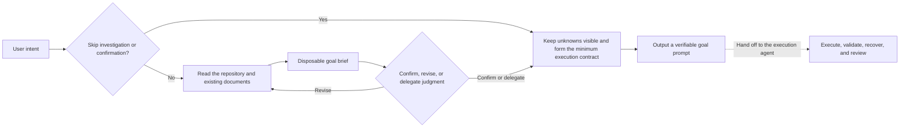

# goal-prompt

> [中文版](README.zh-CN.md)

`goal-prompt` creates `/goal` prompts with a clear outcome, bounded scope, and verifiable completion criteria. It reads the task and repository, asks only questions that can change the goal, and returns a copy-pasteable prompt after confirmation. You can also skip investigation or confirmation explicitly, or delegate the remaining judgment to the agent.

It does not execute the task or require a full SPEC workflow up front.

> See [CHANGELOG.md](CHANGELOG.md) for major version changes.


> **Tested with real evals**
>
> goal-prompt uses [skill-up](https://github.com/alibaba/skill-up) for ongoing regression testing. The [baseline test cases](evals/skill-up/cases/) are public and reproducible, and better cases and suggestions are welcome. These evals provide a baseline check for core behavior and quality.

## Why use it?

Writing `/goal` by hand makes prompt size hard to judge:

- Too short, and the agent may rush to completion or stop halfway.
- Too long, or wrapped in a heavy spec workflow, and requirements, design, TODOs, and rules crowd the prompt before execution starts.

| Common approach | What goes wrong | How goal-prompt handles it |
| --- | --- | --- |
| Write `/goal` by hand | Length is hard to control, and scope or completion criteria are easy to miss | Keep the prompt concise and preserve the outcome, scope, completion gates, and essential execution rules |
| Follow only Codex or Claude Code docs | General docs cannot inspect your repository or choose task-specific scope, risks, and evidence | Read the real context before deciding what belongs in the goal |
| Use an older open-source workflow | Some predate current `/goal` behavior; others require several SPEC files and a long setup | Create no extra files by default and give complex work the smallest useful state |
| Generate once and execute immediately | Wrong assumptions flow straight into a long-running task | Investigate, ask, and confirm before generating the final `/goal` |
| Stop after a small failure | A CI wait, permission gap, or failed item can mark the whole goal `blocked` | Keep doing independent work and stop only when all meaningful remaining work is jointly blocked |
| Depend on chat history | Lessons disappear with the conversation, so the next run repeats the same mistakes | Reflect briefly after each loop and keep only high-value, reusable lessons |
| Tie the workflow to one agent | Commands, paths, or instructions break when moving to another agent | Keep the instructions portable and adapt only the platform entrypoint |

## Core design

goal-prompt aims for both efficiency and quality by keeping only the information that must remain true throughout execution.

- Facts first: read the repository and existing documents instead of filling gaps with guesses.
- User control: confirm, revise, delegate judgment, or explicitly skip investigation or confirmation.
- Minimal state: create no files by default; add focused state only when recovery requires it.
- Evidence closes the goal: all scoped gates must pass, and tests cannot stand in for other deliverables.
- Blocking is exceptional: continue independent work and stop only when everything meaningful that remains is jointly blocked.



## How it works

### Two stages

```text
+--------------------------- Step 1: goal-prompt ----------------------------+
|  Real task -> Context -> Key questions -> Confirm or delegate -> Final prompt
+----------------------------------------------------------------------------+

                               ↓  Run /goal

+-------------------------- Step 2: Execution agent -------------------------+
|  Execute in loops -> Review and report -> Capture useful lessons
+----------------------------------------------------------------------------+
```

**Stage one** returns a temporary goal brief with the outcome, scope, exclusions, and completion evidence. It does not generate `/goal` while an assumption that can change the goal remains unresolved.

After the user confirms, delegates judgment, or explicitly skips confirmation, **stage two** keeps only what the executor needs:

- the expected outcome, scope, and exclusions;
- completion criteria that must all pass, with supporting evidence;
- how to reprioritize around CI, test, or external-dependency blockers;
- when all remaining work is genuinely blocked and stopping is allowed;
- independent review for behavior-changing code.

Ordinary tasks create no extra files by default. Deep or cross-session work uses `.goal-task/<task-slug>/state.md` as the live execution record. Existing requirements, designs, specs, and TODOs remain authoritative and are linked rather than copied.

Create another file only when it has a distinct responsibility:

- `state.md`: current phase, evidence, blockers, active-truth links, and next action;
- `todo.md`: large or frequently changing item-level work;
- `design.md`: confirmed design decisions when no stronger design document exists;
- `lessons.md`: evidence-backed lessons worth reusing.

Do not create a file that duplicates `state.md` or an existing document.

## Install

Install for Codex and Claude Code:

```bash
npx skills add imbajin/goal-prompt -g -a codex -a claude-code
```

Or ask Codex to install it:

```text
$skill-installer install goal-prompt from https://github.com/imbajin/goal-prompt
```

For another agent, run the command below and choose the target:

```bash
npx skills add imbajin/goal-prompt
```

## Use

```text
# Codex / Claude Code
/goal-prompt help me define a goal for implementing the authentication design in this repository
```

The agent can select the skill automatically when your request matches, or you can invoke it manually with `/goal-prompt`. Either way, it generates the prompt without executing it.

## Compatibility

The installable Skill lives under `skills/goal-prompt/` and follows the shared [Agent Skills](https://agentskills.io/) layout. Codex reads `skills/goal-prompt/agents/openai.yaml`; Claude Code reads the standard Skill frontmatter. Both support automatic selection and manual invocation.

Codex can pass the generated text to its native `/goal` runtime for continuous execution. Claude Code can invoke `/goal-prompt` and generate the same structured goal text, but it does not provide Codex's native `/goal` runtime. Continue through Claude Code's normal execution flow instead. Other agents can reuse the Skill when they support Agent Skills.

## References

To avoid designing in isolation or rebuilding existing work, we surveyed and tested five goal-related Skills, then incorporated selected ideas from:

- OpenAI's [`define-goal`](https://github.com/openai/skills/blob/main/skills/.curated/define-goal/SKILL.md) Skill
- the [`goal-prompt-builder`](https://github.com/win4r/goal-prompt-builder) Skill
- a `goal + spec` Skill

See [`fusion-notes.md`](skills/goal-prompt/references/fusion-notes.md) for details.

## License

Apache License 2.0. See [`LICENSE`](LICENSE).
