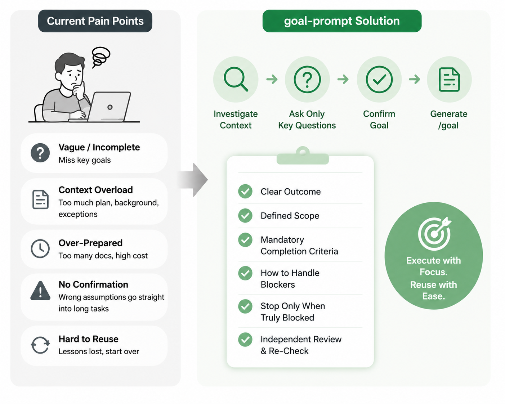

# goal-prompt

> [中文版](README.zh-CN.md)

`goal-prompt` creates `/goal` prompts with a clear outcome, sensible scope, and verifiable completion criteria. It first reads the task and repository, asks only the questions that can change the goal, waits for confirmation, and then returns a copy-pasteable prompt.

It does not execute the task or require a full SPEC workflow up front.



## Why use it

The difficult part of writing a `/goal` is getting the size right. Too little detail and the agent may stop halfway; too much detail and the goal gets buried under background, plans, and exceptions.

| Common approach | What goes wrong | How goal-prompt handles it |
| --- | --- | --- |
| Write `/goal` by hand | Scope and completion criteria are easy to miss, and prompt length varies wildly | Ordinary goals target roughly 12–25 lines; complex goals still have a length limit |
| Follow only the Codex or Claude Code docs | The official docs explain commands and basic rules, but they cannot inspect a specific repository or choose its scope, risks, and evidence | Inspect the real context before deciding what belongs in the goal |
| Use an older or heavier community workflow | Some have not kept up with `/goal`; others require several SPEC files and a long setup | Create no extra files by default, and start complex work with the smallest useful state |
| Generate once and execute immediately | Wrong assumptions go straight into a long-running task | Plan, ask, and confirm before generating the final `/goal` |
| Depend on one agent | Invocation, paths, and terminology break when moving to another agent | Keep the core instructions portable and adapt only the platform entrypoint |

Long-running tasks have another problem: lessons from one iteration often remain buried in chat history, so the next iteration starts from scratch. This skill can capture a short summary of evidence-backed lessons after each iteration or phase without forcing a large knowledge system. Promoting those lessons to Memory still requires separate user approval.

## How it works

```text
Real task
   ↓
Inspect the repository, constraints, and current state
   ↓
Ask questions that can change the goal
   ↓
User confirms the goal brief
   ↓
Generate /goal
   ↓
Execute → summarize useful lessons (optional)
```

**Stage one** returns a temporary goal brief with the outcome, scope, exclusions, and completion evidence. It does not generate `/goal` while a material assumption remains unconfirmed.

Only after confirmation does it enter **stage two**. The final prompt contains only what the executor needs:

- the expected outcome, scope, and exclusions;
- completion criteria that must all pass, with supporting evidence;
- how to reprioritize around CI, test, or external-dependency blockers;
- when all remaining work is genuinely blocked and stopping is allowed;
- independent review for behavior-changing code.

Ordinary tasks create no extra files by default. For work that must resume across sessions, prefer one `.goal-task/<task-slug>/state.md` over maintaining `plan.md`, `todo.md`, `progress.md`, and `lessons.md` together.

If a task is large enough that those concerns need separate ownership or update cycles, each file has a distinct role:

- `plan.md`: overall approach, phases, and dependencies;
- `todo.md`: current work items, priorities, and status;
- `progress.md`: completed work, validation evidence, blockers, and resume point;
- `lessons.md`: evidence-backed lessons, failed assumptions, and reusable practices.

If one executor maintains all four at roughly the same pace, keeping them together in `state.md` is simpler.

## Install

Install for Codex and Claude Code:

```bash
npx skills add imbajin/goal-prompt -g -a codex -a claude-code
```

Or ask Codex to install it:

```text
$skill-installer install goal-prompt from https://github.com/imbajin/goal-prompt
```

For another agent, run the command below and choose the target platform:

```bash
npx skills add imbajin/goal-prompt
```

## Use

```text
# Codex / Claude Code
/goal-prompt help me define a goal for implementing the authentication design in this repository
```

The agent can select the skill automatically when the request matches, or you can invoke it manually with `/goal-prompt`. Either way, it generates the prompt but does not execute it.

## Compatibility

The core skill uses the shared [Agent Skills](https://agentskills.io/) layout under `skills/goal-prompt/`. Codex reads its entrypoint metadata from `skills/goal-prompt/agents/openai.yaml`; Claude Code uses the standard skill frontmatter. Both allow automatic selection and manual invocation.

Codex can pass the generated text to its native `/goal` runtime for continuous execution. Claude Code can invoke `/goal-prompt` and receive the same structured goal text, but it does not provide Codex's native `/goal` runtime; run the generated task through Claude Code's normal execution flow instead. Other agents can reuse the skill when they support Agent Skills.

## Development

```bash
npx skills@1.5.20 add . --list
```

See [`skills/goal-prompt/references/fusion-notes.md`](skills/goal-prompt/references/fusion-notes.md) for source lineage and design decisions.

## License

Apache License 2.0. See [`LICENSE`](LICENSE).
