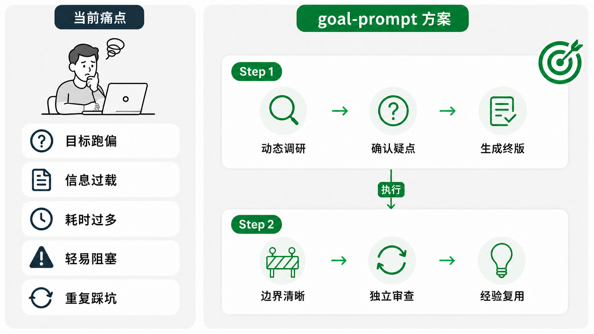
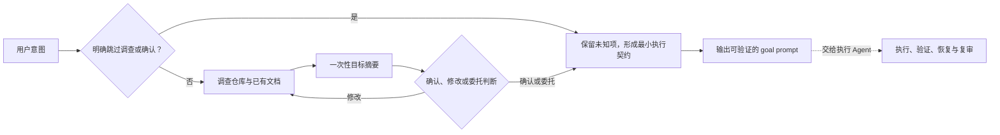

# goal-prompt

> [English Version](README.md)

`goal-prompt` 用来生成长度合适、边界清楚、可以验证结果的 `/goal`。它会先了解任务和仓库，只问会改变目标的问题，确认后输出可直接复制的 prompt。你也可以明确跳过调查或确认，或者把剩余判断交给 Agent

它不执行任务，也不要求先搭一整套 SPEC

>版本核心变动见 [CHANGELOG.md](CHANGELOG.md)



> **实际回测**
>
> goal-prompt 已使用 [eval-system: skill-up](https://github.com/alibaba/skill-up) 持续回归，[基础实测 case](evals/skill-up/cases/) 公开可复现，也欢迎补充 case 或提出更好的建议。eval 确保核心行为稳定性 + 基本质量保障

## Why need it？

自己写 `/goal` 时，最难拿捏的是尺度：
- 写短了，Agent 很快就做完 or 做到一半就提前标记完成
- 写长了，或引入复杂 spec（需求/设计/TODOs 和规则全挤在一起），非常耗时 + 执行时约束过多

| 常见做法 | 实际问题 | goal-prompt 的处理 |
| --- | --- | --- |
| 直接手写 `/goal` | 篇幅难，范围和完成条件容易漏 | 保持精炼，优先保留结果、范围、完成门槛和必要执行语义 |
| 只参考 Codex/CC 官方说明 | 官方文档解释了命令和基础规则，但不会结合具体仓库判断范围、风险和验证方式 | 先调查真实上下文，再决定目标里该留什么 |
| 使用较早的开源方案 | 有的没有跟上 `/goal` 的变化；有的依赖多 SPEC 文档，准备时间很长 | 默认不创建额外文件，复杂任务也从一份最小状态开始 |
| 一次生成后直接执行 | 错误假设会原样进入长任务 | 先规划、提问和确认，再生成最终 `/goal` |
| 小失败，提前终止 | CI 等待、权限缺口或单项失败就让整体 `blocked` | 只要还有独立工作就继续，只有全部剩余工作共同受阻才停止 |
| 只依赖历史 context  | 踩坑/经验没有沉淀，下一轮重复试错 | 每轮简要反思，只记录高价值 + 可复用的内容 |
| 写法绑定单一 Agent | 换到其他 Agent 后，调用方式/目录或指令对不上 | 指令/保持通用，只对平台入口做少量适配 |

## 核心设计

`goal-prompt` 目标是高效率 + 尽可能提高质量的前提下，保留执行期间必须有的信息

- 事实优先：先读仓库和已有文档，不用猜测补齐空白
- 用户控制：用户可以确认、修改、委托判断，也可以明确跳过调查或确认
- 状态最小：默认不建文件；需要恢复时才创建职责清楚的状态文件
- 证据闭环：范围内的完成门槛必须全部通过，测试成功不能代替其他交付证据
- 阻塞从严：只要还有独立工作就继续，只有全部剩余工作共同受阻时才停止



## 工作方式

### 两阶段流程

```text
+--------------------------- Step 1: goal-prompt ----------------------------+
|  真实任务 -> 调查上下文 -> 关键问题 -> 确认或委托 -> 生成最终 prompt
+----------------------------------------------------------------------------+

                              ⬇️  执行 /goal

+---------------------------- Step 2: 执行 Agent ----------------------------+
|  执行迭代 -> review + 小结 -> 归纳经验（可选）
+----------------------------------------------------------------------------+
```

**第一阶段**只返回临时目标摘要，包括预期结果、范围、排除项和完成证据。会改变目标的假设没有确认前，不会生成 `/goal`

用户确认、委托判断或明确跳过确认后，进入**第二阶段**。最终 prompt 只保留执行需要的内容：

- 预期结果、范围和排除项；
- 必须全部满足的完成条件和验证证据；
- 遇到 CI、测试或外部依赖阻塞时如何调整顺序；
- 全部剩余工作确实无法继续时，允许停止的条件；
- 行为变更代码所需的独立审查

普通任务默认不创建额外文件。深度任务或跨会话任务使用 `.goal-task/<task-slug>/state.md` 记录当前执行状态。已有 requirement、design、SPEC 和 TODO 继续作为权威事实，通过链接复用，不复制内容

只有职责明确且不会重复时，才增加其他文件：

- `state.md`：记录当前阶段、证据、阻塞、事实入口和下一步；
- `todo.md`：维护大量或频繁变化的事项级任务；
- `design.md`：没有更权威设计文档时，保存已经确认的设计决定；
- `lessons.md`：保存有证据且值得复用的经验

如果新增文件会重复 `state.md` 或已有文档，就不要创建

## 安装

安装到 Codex + Claude Code：

```bash
npx skills add imbajin/goal-prompt -g -a codex -a claude-code
```

也可以让 Codex 安装：

```text
$skill-installer 从 https://github.com/imbajin/goal-prompt 安装 goal-prompt
```

其他 Agent 可以运行下面的命令，再选择单独 Agent 类别：

```bash
npx skills add imbajin/goal-prompt
```

## 使用

```text
# Codex / Claude Code
/goal-prompt 帮我给当前目录的认证模块定一个任务计划, 参考 XX 设计实现
```

需求沟通时，Agent 可自动调用这个 skill，你也可以用 `/goal-prompt` 手动调用。无论哪种方式，它只生成 prompt，不会直接执行

## 兼容说明

核心内容位于 `skills/goal-prompt/`，使用通用的 [Agent Skills](https://agentskills.io/) 目录结构。Codex 通过 `skills/goal-prompt/agents/openai.yaml` 提供入口信息，Claude Code 使用标准 skill frontmatter；两者都允许自动选择和手动调用

Codex 可以把生成的文本交给原生 `/goal` 持续执行。Claude Code 可以调用 `/goal-prompt` 并生成同样的结构化目标文本，但没有 Codex 原生 `/goal` 的运行语义，需要通过 Claude Code 的普通执行流程继续任务。其他支持 Agent Skills 的 Agent 也可以复用

## 参考资料

为了避免闭门造车 or 重复造轮， 先广搜并实测了 top5 的 goal-skills，并参考了下面引用的部分思路/设计 （并使用 20+ cases 进行对比评测）
- OpenAI 官方 [`define-goal`](https://github.com/openai/skills/blob/main/skills/.curated/define-goal/SKILL.md) skill
- [`goal-prompt-builder`](https://github.com/win4r/goal-prompt-builder) skill
- `goal + spec` skill

>详情见 [`fusion-notes.md`](skills/goal-prompt/references/fusion-notes.md)

## 许可证

Apache License 2.0，详见 [`LICENSE`](LICENSE)
