# HugeGraph goal-prompt A/B：8 月 20 日到 21 日做了什么

> 记录范围：2026-08-20 ～ 2026-08-21（Asia/Shanghai）<br>
> 这不是“已经证明 B 更好”的结果报告，而是实验从设计、实现到真实运行前的阶段记录。

## 先说结论

这次做的 A/B，不是比较两段 Prompt 谁写得长，也不是让评审凭感觉选一段文字。

- A 组：模型**不使用 `goal-prompt` Skill**，根据固定用户需求生成 `/goal`。
- B 组：模型**使用 `goal-prompt` Skill**，根据同一份需求生成 `/goal`。
- 两份 `/goal` 再交给同一个执行模型，分别在两份相同源码上完成任务。
- 最后看真实行为：前端能不能点通、后端会不会串图、文档版本能不能执行。

截至本文落笔时：

| 项目 | 实际状态 |
| --- | --- |
| 三个实验任务 | 已确定并写入 suite |
| A/B 编排、隔离、盲评、汇总 | 已实现，确定性测试已通过 |
| HugeGraph / Toolchain / Hubble 依赖预热 | 今天已逐段构建成功 |
| 最终 executor / oracle 镜像 | 尚未完成；Docker 内部存储写入 EIO |
| 真实 Pilot | **未运行，A/B 模型调用仍为 0** |
| 真实 Formal | 未运行 |
| GitHub PR | 已是正式 Open PR，不是 Draft |

因此现在可以说“实验台搭好了大部分”，不能说“B 比 A 好”。

---

## 1. 把“评 Prompt”改成“看任务有没有真的完成”

### Before / After

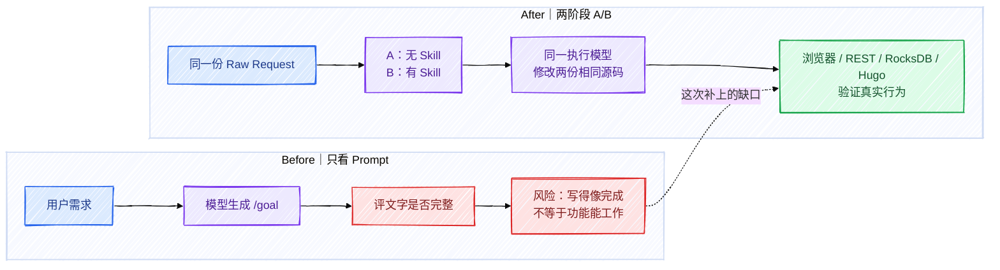

真正的实验变量只有一个：生成 `/goal` 时有没有 `goal-prompt`。

| 固定项 | A、B 如何保持一致 |
| --- | --- |
| 用户输入 | 同一份 `raw-request.txt`，逐字节一致 |
| 源码 | 同一次 preflight 生成两份工作副本 |
| 版本证据 | 两臂读取同一份只读 `version-evidence` |
| 执行模型 | 相同 model、reasoning effort、超时和资源限制 |
| 验收 | 相同 trusted oracle 和 rubric |
| 唯一差异 | A 的 `skills=[]`；B 注入本地 `goal-prompt` |

这一步解决的问题很具体：原来的 Prompt-level eval 最多说明“生成了一份像样的 `/goal`”；新的两阶段实验才能回答“这份 `/goal` 是否真的让执行结果更好”。

---

## 2. 前端题：从“空页面好不好看”变成一条真实点击链

### 任务数据

```text
GraphState {
  vertices: 0,
  edges: 0,
  graphspace: "DEFAULT",
  graph: "hugegraph"
}

VertexLabel person {
  name: string,          // PRIMARY_KEY，必填
  description: string?  // nullable，可后补
}
```

### Before / After

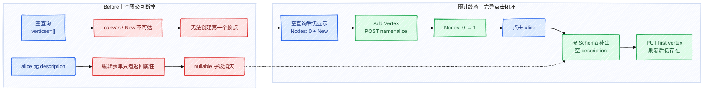

验收不是只看截图，而是检查这些动作和字段：

1. 空查询后 `New → Add Vertex` 可以真实点击。
2. 创建请求只发一次，body 至少包含 `label=person`、`name=alice`。
3. 节点数必须从 `0` 变成 `1`，不能用幽灵节点凑数。
4. 点击 `alice` 后，即使返回对象没有 `description`，表单也要根据 Schema 显示空输入框。
5. 保存时只发一次 PUT，并带上 `description=first vertex`。
6. 刷新后重新读取，`name` 和 `description` 都存在。
7. 注入 POST 500：不能产生节点，`name=bob` 仍留在表单。
8. 注入 PUT 500：不能显示假成功，数据库仍保留旧值。
9. 空图没有端点时，Add In/Out Edge 可以隐藏或 disabled，但不能执行。

实际 A/B 结果：A 待运行，B 待运行。今天完成的是浏览器验收工具和任务输入，不是功能修复本身。

| 起始状态 | 预计终态 | A 实际效果 | B 实际效果 | 当前差距 |
| --- | --- | --- | --- | --- |
| 空图无法创建首顶点；缺失的 nullable 字段不能编辑 | `Nodes: 0→1`，真实 POST/PUT、刷新持久化、失败不假成功 | 未运行 | 未运行 | 还没有模型修改后的源码，也没有 A/B 行为分 |

---

## 3. 后端题：把 graph identity 纳入首次批写隔离

### 输入结构和风险

```text
BatchEntry {
  op_type: PUT | MERGE,
  table: integer,
  start_key: bytes,
  value: bytes
}

doBatch(
  graph: string,       // graph A / graph B 的隔离身份
  partition: integer,  // 两边故意相同
  entries: BatchEntry[]
)
```

测试故意让两个新图使用相同的 `partition + table + logical key`。如果首次批写生成物理 key 时漏掉 graph identity，graph B 就可能读到、累计或删除 graph A 的数据。

### Before / After

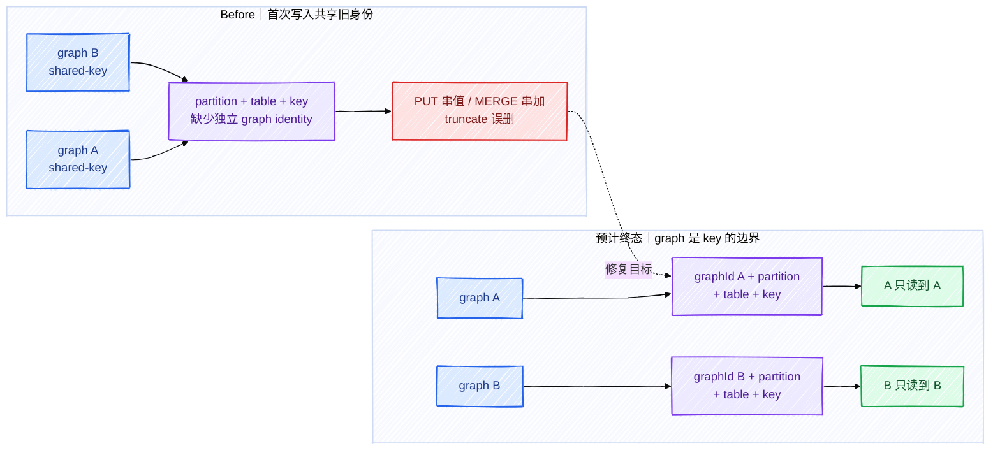

后端验收拆成两层，避免“单测绿了就说整条链修好了”：

| 层级 | 实际动作 | 证明什么 |
| --- | --- | --- |
| L1：REST | 1.7 auth-enabled HStore 创建不同 graphspace / graph / store，向 A 写 marker，再从 B 读取 | REST namespace 到 Store 的完整链路没有串图 |
| L2：Store Core | `doBatch()` PUT/MERGE、`doGet()`、`truncate()`、真实 RocksDB | 事务批写和物理 key 隔离正确 |

L2 还覆盖：

- MERGE：A 得到 11，B 得到 29，不能合成 40。
- truncate：清 B 不影响 A。
- rollback：第二条非法 entry 触发真实失败，第一条不能部分可见；重试能成功。
- 并发：12 个新 graph 首次写入，不串值、不死锁、不占用保留 identity。
- 兼容：已有合法 graph identity 写入的数据仍可读，不能顺手改变 physical-key 格式。

实际 A/B 结果：A 待运行，B 待运行。当前完成的是隐藏行为测试、RocksDB/REST 驱动和评分规则。

| 起始状态 | 预计终态 | A 实际效果 | B 实际效果 | 当前差距 |
| --- | --- | --- | --- | --- |
| 两个新 graph 在相同 partition/table/key 下可能复用错误身份 | PUT/MERGE/truncate/rollback/并发与旧数据兼容全部隔离 | 未运行 | 未运行 | 还没有候选修复，也没有 L1/L2 的 A/B 对比分数 |

---

## 4. 文档题：把 1.5、1.7、master 从一段混写拆成版本合同

### Before / After

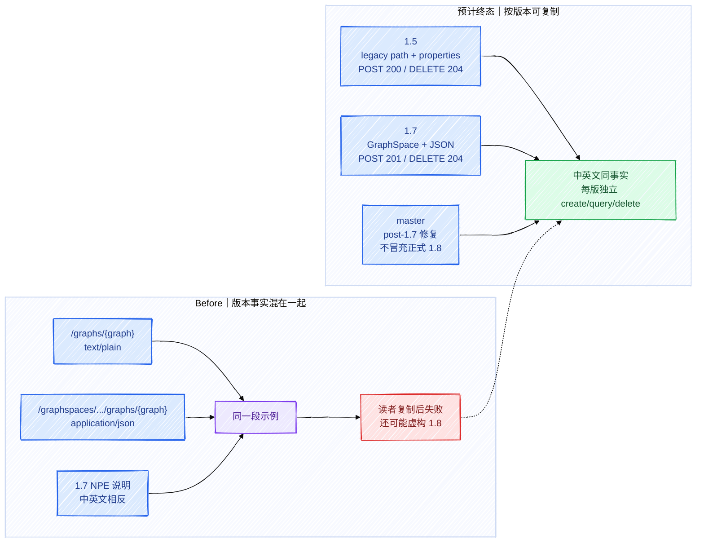

版本合同已经明确到字段级：

| 版本 | Path | POST body / Content-Type | POST / DELETE | 关键边界 |
| --- | --- | --- | --- | --- |
| 1.5 | `/graphs/{graph}` | properties，`text/plain` | `200 / 204` | legacy 流程单独写 |
| 1.7 | `/graphspaces/{graphspace}/graphs/{graph}` | `gremlin.graph`、`backend`、`serializer`、`store`，JSON | `201 / 204` | auth-enabled 是支持路径；non-auth creator context 可能 NPE |
| master | 按当前 Server 源码 | JSON | 按当前证据 | 包含 post-1.7 修复；没有正式 1.8 ref |

验收同时检查中英文页面、Hugo build、链接、Server 源码或隔离 API smoke。站点能构建，只能证明 Markdown/Hugo 没坏，不能证明 API 示例是对的。

实际 A/B 结果：A 待运行，B 待运行。当前没有任何一份由真实 A/B Agent 改出的文档。

| 起始状态 | 预计终态 | A 实际效果 | B 实际效果 | 当前差距 |
| --- | --- | --- | --- | --- |
| 1.5/1.7/master 的 path、body、状态码和 NPE 边界混写 | 每个版本有中英文一致、可复制、经 API 证据支持的流程 | 未运行 | 未运行 | 只有版本合同和 oracle，没有 Agent 产出的 A/B 文档 |

---

## 5. 结果数据从“一段文本”变成可追踪的四层记录

### Before / After

```mermaid
%%{init: {"theme":"base","look":"handDrawn","flowchart":{"curve":"basis"}}}%%
flowchart LR
  subgraph Before["Before｜只有模型输出"]
    B1["response.txt"] --> B2["人工看起来不错"]
    B2 --> B3["不知道输入是否相同\n不知道执行是否成功"]
  end

  subgraph After["After｜四层结果"]
    A1["PairManifest\n题目、轮次、顺序、匿名臂"] --> A2["PromptMetrics\n状态、token、耗时、turns"]
    A2 --> A3["ExecutionRun\nPASS / MODEL / ENV"]
    A3 --> A4["TrustedScore\n行为分、critical failures"]
    A4 --> A5["PairSummary\nB-A、win/tie/loss、成本"]
  end

  B3 -.-> A1

  classDef blue fill:#dbeafe,stroke:#2563eb,color:#1e3a8a;
  classDef purple fill:#ede9fe,stroke:#7c3aed,color:#4c1d95;
  classDef green fill:#dcfce7,stroke:#16a34a,color:#14532d;
  classDef red fill:#fee2e2,stroke:#dc2626,color:#7f1d1d;
  class B1,A1,A2 blue; class A3,A4 purple; class A5 green; class B2,B3 red;
```

这四层记录里真正有用的字段如下：

```text
PairManifest {
  case_id,
  pair_id,
  cohort,           // pilot | formal
  repeat,
  arm_ids[2],       // 匿名 id，不写 A/B 身份
  prompt_order,
  execution_order,
  source_sha256,
  version_evidence_sha256,
  raw_request_sha256
}

PromptMetrics {
  status,
  failure_kind,
  failure_class,
  input_tokens,
  output_tokens,
  duration_seconds,
  turns,
  retries,
  prompt_score
}

ArmResult {
  status,
  behavior_score,
  raw_score,
  completed,
  critical_failures[],
  prompt_metrics,
  execution_duration_seconds,
  attempts
}
```

这里保留 `source_sha256` 不是为了冻结一个长期 baseline，而是防止同一 pair 的 A、B 不小心拿到不同源码；数值只保存在当次 `.eval-work`，不会作为项目版本号或 CI gate。

---

## 6. 失败不再全部算“模型 0 分”

### Before / After

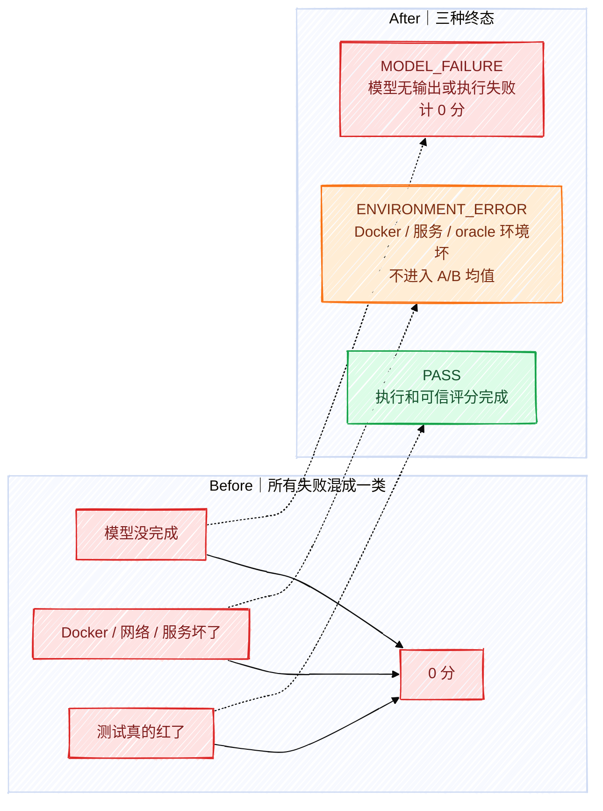

`critical_failures` 也不是普通扣几分。下面这些情况会直接破坏“任务完成”的结论：

- 前端请求落到错误 graph，或声称持久化成功但刷新读不到。
- 后端出现跨 graph 读取、覆盖、MERGE 累加或 truncate 误删。
- 只跑 mock，却声称完整 HStore/REST 缺陷已修。
- 文档把不存在的正式 1.8 写成已发布。
- Agent 声称测试全过，但 trusted oracle 看到失败。

今天 Docker 的 `metadata_v2.db` EIO 就属于环境失败，不能拿来判 A 或 B 低分。

---

## 7. 两臂从“可能互相污染”变成匿名、独立、最后才揭盲

### Before / After

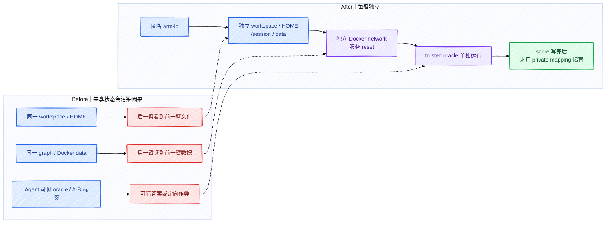

昨天到今天补齐的隔离边界包括：

1. A/B 路径里只出现匿名 arm id，不出现 `with_skill` / `without_skill`。
2. 两臂各自拥有 workspace、HOME、session、data、agent-artifacts。
3. `version-evidence` 只读；`.git` 历史、issue/PR 答案和 trusted runner 不进入 Agent 工作区。
4. executor 镜像不包含 oracle 脚本；oracle 镜像里的 trusted 文件不可由候选代码修改。
5. 每臂服务使用独立 internal network 和数据根，执行前 prepare，评分前 reset，所有终态 cleanup。
6. 真实 provider key 只留在本地代理一侧，Agent 只拿短期代理凭据；公开答案源和 hosted search/tool 入口被拒绝。

---

## 8. 从“固定先跑 B”改成预登记、平衡顺序、失败也保留

### Before / After

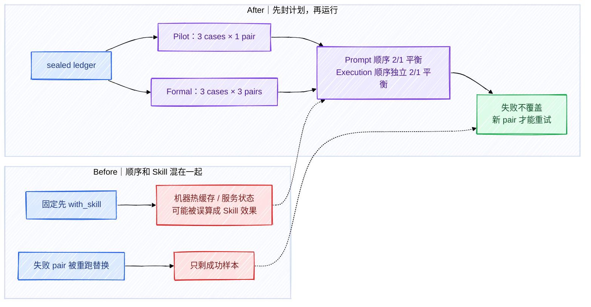

计划的真实调用量是：

| 阶段 | `/goal` 生成 | 下游执行 | 作用 |
| --- | ---: | ---: | --- |
| Pilot | 3 个任务 × A/B = 6 | 6 | 验证整条实验链可运行、能区分模型/环境/行为失败 |
| Formal | 3 个任务 × 3 pairs × A/B = 18 | 18 | 看每题 `B-A`、中位数、win/tie/loss 和成本 |

当前两个阶段都还没有真实结果。确定性测试使用 fake generator / fake executor，只证明编排正确，不能放进 A/B 成绩表。

---

## 9. 今天实际推进到哪里：依赖构建成功，最终镜像被 Docker 存储挡住

### Before / After

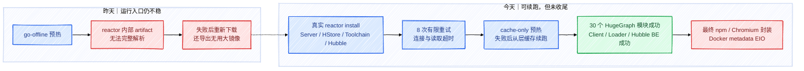

今天已经拿到的真实构建证据：

- HugeGraph 30 个 reactor 模块全部 `BUILD SUCCESS`，包括 Server、HStore、Store Core、Store Test 和分发包。
- Toolchain 的 Client 和 Loader 构建成功。
- Hubble Backend 在 Maven Central 抖动后通过有限重试构建成功。
- Node 18.20.8 和 Yarn 1.22.21 下载包校验通过。
- 最终 runtime base 安装 npm / Playwright 时，Docker 写 `metadata_v2.db` 报 EIO，Docker Desktop 随后无法正常启动。

为了恢复空间，清理的是可重新下载的构建缓存、旧 pnpm store、VS Code 扩展安装包、Docker 安装中间副本和 6 个临时 A/B 卷；没有删除源码、已安装扩展、MemOS 持久数据卷或真实实验结果。

当前未提交的 runtime 调整只有两类：

1. 预热从 `go-offline` 改成真实 reactor `install`，并加有限重试/超时。
2. Maven 预热阶段改成 `cache-only`，不再导出一份无用的大镜像。

它们还需要在 Docker 恢复后完成最终镜像构建、runtime probe 和确定性回归，才能提交。

---

## 10. 交付状态：PR 已 Open，但还不是“实验完成”

### Before / After

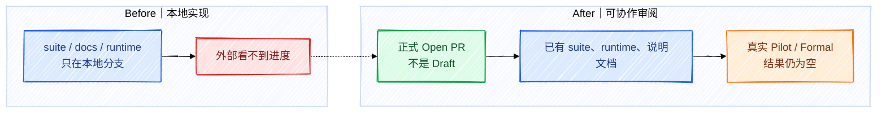

- PR：[feat(hugegraph-ab): add paired goal-prompt evaluation suite](https://github.com/imbajin/goal-prompt/pull/2)
- 当前状态：`OPEN`、`isDraft=false`。
- GitHub 当前没有列出 status checks，合并状态仍显示 `UNSTABLE`；所以“Open”只代表进入正式评审，不代表已经可合并。
- 现有飞书说明：[Goal-prompt HugeGraph A/B 测试说明](https://hugegraph.feishu.cn/docx/G7R4dmOwSotzMMxp3zwcGNHsnPe)

---

## 11. 从现在到终态还差什么

### Before / After

```mermaid
%%{init: {"theme":"base","look":"handDrawn","flowchart":{"curve":"basis"}}}%%
flowchart LR
  subgraph Now["现在"]
    N1["实验设计与 suite：完成"] --> N2["真实依赖预热：完成"]
    N2 --> N3["最终镜像：Docker EIO"]
    N3 --> N4["真实 A/B：0 次"]
  end

  subgraph Target["预计终态"]
    T1["恢复 Docker\n完成 executor/oracle 镜像"] --> T2["模型通路 + 隔离 probe"]
    T2 --> T3["Pilot：3 个 clean pairs"]
    T3 --> T4["Formal：9 个 clean pairs"]
    T4 --> T5["A/B 分数、critical、成本\n回填 Markdown 和飞书"]
  end

  N4 -.->|"下一步"| T1

  classDef blue fill:#dbeafe,stroke:#2563eb,color:#1e3a8a;
  classDef green fill:#dcfce7,stroke:#16a34a,color:#14532d;
  classDef red fill:#fee2e2,stroke:#dc2626,color:#7f1d1d;
  class N1,N2,T1,T2 blue; class N3,N4 red; class T3,T4,T5 green;
```

下一步按这个顺序执行：

1. 恢复 Docker 内部存储，确认 daemon 能稳定读写。
2. 从现有 BuildKit 缓存完成 executor / oracle 镜像，不重编已成功的 30 个模块。
3. 运行模型端点、公开外网拒绝、私有服务可达、凭据不落盘的 isolation probe。
4. 跑 Pilot 三题各一个 pair，必须保留失败 pair，不能挑成功结果。
5. Pilot 健康后跑 Formal 九个 pairs。
6. 回填每题 A、B、`B-A`、critical failures、token、耗时、turns，以及与预计终态的差距。
7. 更新本 Markdown、飞书文档和 PR，再做最终结果复核。

## 完成度

- Suite 实现主线：**100%**。任务选择、两阶段协议、三个 rubric、隔离、盲评、失败分类、确定性测试和真实服务探针已经完成。
- 整体实验：**50%**。口径为：研究/设计/suite/preflight 45%，Pilot 25%，Formal 20%，最终分析/报告 10%；目前只给 Pilot 的运行准备计 5 个百分点。
- 当前阻塞：Docker 内部存储 EIO，导致最终镜像和真实 Pilot 不能启动。
- 不算阻塞的可选项：进一步美化文档、增加更多任务、接 CI gate。这些不进入主线完成度。
