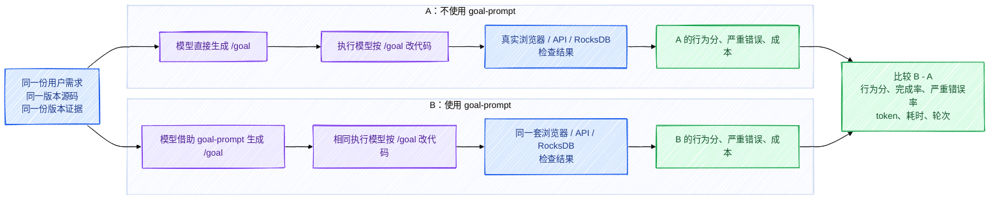

# Goal-prompt 的 HugeGraph A/B 测试，到底在测什么

## 一句话说明

给同一个真实开发任务准备两份完全相同的源码：

- **A 组**：不提供 `goal-prompt`，让模型直接把用户需求整理成 `/goal`。
- **B 组**：提供 `goal-prompt`，再让模型整理同一个需求。

两组生成的 `/goal` 随后交给相同的执行模型，在各自独立的源码副本上实施。最后不比较“哪份 Prompt 写得更漂亮”，而是比较：**功能是否真的完成、是否出现严重错误、花了多少时间和 token。**

## A/B 对比图



这张图里只有一个实验变量：**生成 `/goal` 时有没有使用 `goal-prompt`**。源码、任务、执行模型、版本证据和验收方式都必须相同。

## 模型实际收到的三份模拟用户输入

这里的“模拟用户”不是随便生成一句需求，而是三份固定的 Raw Request。每份输入都会逐字节复制给 A、B 两组：

- A 组看不到 `goal-prompt`；
- B 组可以使用 `goal-prompt`；
- 两组都只生成 `/goal`，不在这一阶段修改源码。

### 输入一：前端用户想在空图里创建并编辑第一个顶点

模拟用户给出的关键数据是：

```text
当前图：0 vertex / 0 edge
VertexLabel：person
主键：name
可空字段：description

第一次创建：name=alice，不提交 description
第一次编辑：description=first vertex
失败注入：POST 500、PUT 500
```

用户要求模型生成一个 `/goal`，指导执行 Agent 修通下面的真实点击链：

```text
空查询 → New → Add Vertex → POST alice → Nodes 0→1
→ 点击 alice → 出现空 description → PUT first vertex
→ 刷新后仍存在
```

同时必须验证 POST 失败不产生 ghost vertex、PUT 失败不显示假成功，且请求只能落到当前 graphspace/graph。

### 输入二：后端用户想修复两个新 graph 首次批写串数据

模拟用户固定了冲突条件：

```text
graph A、graph B：graphspace / graph / store 名称不同
partition：相同
table：相同
logical key：shared-key

BatchEntry：op_type、table、start_key、value
graph：作为 doBatch(graph, partition, entries) 的独立参数
```

用户要求 `/goal` 同时覆盖 PUT、MERGE 11/29、truncate、失败 rollback、retry、12 个新 graph 并发首次写和旧 Graph ID 数据兼容；不能只写 mock。验证必须包括真实 REST 隔离以及 `BusinessHandler + RocksDB` 隔离。

### 输入三：文档用户想获得不混写版本的 Graphs API 说明

模拟用户要求模型把下面三套事实拆开：

| 版本 | Path | POST body / Content-Type | POST / DELETE |
| --- | --- | --- | --- |
| 1.5 | `/graphs/{graph}` | properties，`text/plain` | `200 / 204` |
| 1.7 | `/graphspaces/{graphspace}/graphs/{graph}` | `gremlin.graph`、`backend`、`serializer`、`store`，JSON | `201 / 204` |
| master | 继续按当前源码证据说明，不能虚构正式 1.8 | JSON | 按当前源码核验 |

用户还要求 `/goal` 指导执行 Agent 同时修改中英文页面，区分：

```text
1.7 auth-enabled：支持路径
1.7 non-auth creator context：可能 NPE
post-1.7/master：包含后续修复
```

站点能构建不算完成，还必须核对 API 行为和版本事实。

## 到目前为止，哪些 A/B 测试真的做了

| 测试 | 当前状态 | 它证明了什么 | 它没有证明什么 |
| --- | --- | --- | --- |
| 三份 Raw Request 一致性检查 | 已完成 | A、B 收到的用户输入逐字节相同 | 不代表模型能生成好 `/goal` |
| A 无 Skill / B 有 Skill 的 fixture 分离 | 已完成 | A 看不到 `goal-prompt`，B 能看到；源码、证据和环境相同 | 不代表 B 的输出更好 |
| 两阶段确定性编排测试 | 已完成，但使用 fake generator / fake executor | `/goal` 生成、下游执行、盲评、失败分类、汇总流程能走通 | 这些是假响应，不能当 A/B 成绩 |
| 真实服务生命周期与行为探针 | 已完成 | 浏览器、HugeGraph、RocksDB、文档 API 的验收工具能够启动、重置和清理 | 没有让模型修改代码 |
| Pilot：三题各 1 pair | **未运行模型** | 计划应产生 6 次 `/goal` 生成和 6 次下游执行 | 当前没有 A/B 分数 |
| Formal：三题各 3 pairs | **未开始** | 计划应产生 18 次 `/goal` 生成和 18 次下游执行 | 当前没有胜负或成本差异 |

所以当前准确结论是：**实验题目、模拟用户输入和测量工具已经准备并自测；真实 A/B 模型调用数仍是 0。** 目前不能回答 A 或 B 哪个更好。

## 尚未运行的真实 A/B，预计怎么测

这里的预期不是“A 一定失败、B 一定成功”。A、B 必须接受同一套通过条件。要验证的假设是：使用 `goal-prompt` 后，模型生成的 `/goal` 是否更少遗漏关键行为、是否减少严重错误，以及为此增加了多少 token、时间和轮次。

### Pilot：先确认实验真的能测出东西

Pilot 对三个任务各运行 1 个 pair：

```text
3 份模拟用户输入
× A/B 两组
= 6 次 /goal 生成

6 份 /goal
× 1 次独立下游执行
= 6 次真实任务实施
```

Pilot 不负责证明 B 胜出，只检查这些问题：

1. A、B 是否收到完全相同的用户输入、源码和版本证据；
2. A 是否确实没有 `goal-prompt`，B 是否确实拥有它；
3. 两组生成的 `/goal` 是否都能被执行，而不是只写分析文字；
4. 浏览器、REST、RocksDB、Hugo 等真实验收能否区分“做完”和“声称做完”；
5. 模型失败、环境失败和功能失败能否分开记录；
6. 每一臂能否记录行为分、严重错误、token、耗时和轮次。

### 三个任务各自要执行的真实测试

| 任务 | A、B 都要执行的动作 | 通过条件 | A 结果 | B 结果 |
| --- | --- | --- | --- | --- |
| Hubble 空图首顶点 | 空查询；点击 New/Add Vertex；POST `name=alice`；点击节点；补写 `description=first vertex`；刷新；再注入 POST/PUT 500 | `Nodes: 0→1`；nullable 输入出现；只请求当前 graph；刷新后值存在；失败时无 ghost/假成功 | 待 Pilot 填写 | 待 Pilot 填写 |
| HStore 多图隔离 | 两个新 graph 使用相同 `partition/table/shared-key`；分别跑 PUT、MERGE 11/29、truncate、rollback/retry、12 路并发和旧 ID 读取 | graph B 不能看到 graph A marker；MERGE 分别为 11/29；truncate graph B 不影响 graph A；失败 batch 无部分数据；并发不串值、不死锁 | 待 Pilot 填写 | 待 Pilot 填写 |
| Graphs API 文档 | 分别检查 1.5、1.7、master 的 GET/POST/DELETE；对比 EN/CN；运行 Hugo/link；执行 1.7 API smoke | path、Content-Type、body、backend、auth、状态码按版本绑定；双语事实一致；正确说明 non-auth NPE 与 post-1.7 修复 | 待 Pilot 填写 | 待 Pilot 填写 |

### 每一臂最终记录哪些字段

```text
ArmResult {
  prompt_score,
  behavior_score,
  completion_status,
  critical_failures[],
  tests_passed[],
  tests_failed[],
  input_tokens,
  output_tokens,
  elapsed_seconds,
  turns,
  environment_error
}
```

其中 `critical_failures` 不是普通扣分。例如跨 graph 读到别人的数据、声称测试通过但真实行为失败、虚构正式 1.8，都会让该臂失去有效完成结论。

### Formal：Pilot 健康后再比较稳定效果

Formal 对三个任务各运行 3 个 pairs，共：

```text
9 pairs
= 18 次 /goal 生成
+ 18 次下游任务执行
```

每个任务的三次重复会平衡 A/B 先后顺序，最终报告：

- 每个任务三次 `B - A` 行为分差；
- A、B 的中位数，而不是只挑最好的一次；
- win / tie / loss；
- 严重错误数量；
- token、耗时和轮次差异；
- 环境失败、模型失败和未完成项。

三次重复只用于工程判断，不会包装成“统计显著”。最终结果表现在仍应保持为空：

| 任务 | A 行为分 | B 行为分 | B-A | 严重错误 | 成本差异 |
| --- | ---: | ---: | ---: | --- | --- |
| Hubble | 待运行 | 待运行 | 待运行 | 待运行 | 待运行 |
| HStore | 待运行 | 待运行 | 待运行 | 待运行 | 待运行 |
| Docs | 待运行 | 待运行 | 待运行 | 待运行 | 待运行 |

---

# 任务一：Hubble 空图创建第一个顶点

## 起始状态

用户在一个 `0 vertex / 0 edge` 的空图里执行查询：

```groovy
g.V().hasLabel('person')
```

实际问题不是“页面不好看”，而是这条用户路径走不通：

1. 查询返回 `vertices=[]` 后，部分版本不会渲染可操作的 2D canvas。
2. `New → Add Vertex` 不可达，用户无法创建图里的第一个顶点。
3. 顶点 Schema 是：

   ```json
   {
     "label": "person",
     "primary_key": "name",
     "properties": {
       "name": {"nullable": false},
       "description": {"nullable": true}
     }
   }
   ```

4. 创建 `alice` 时没有提交 `description`：

   ```json
   {
     "label": "person",
     "properties": {"name": "alice"}
   }
   ```

5. 后端返回的顶点对象里也没有 `description`。旧编辑逻辑只展示“返回对象中已经存在的属性”，因此 Schema 里明明有 nullable `description`，编辑表单却看不到它。

## 预计终态

用户应该能完整走完下面这条路径：

1. 空查询后仍显示 canvas、`Nodes: 0` 和可点击的 `New`。
2. `Add Vertex` 选择 `person`，填写 `name=alice`。
3. 只向当前 `DEFAULT/hugegraph` 发送一次 POST；成功后节点数从 `0 → 1`。
4. 点击 canvas 中的 `alice`，编辑表单根据 Schema 补出空的 `description`。
5. 填写 `description=first vertex`，只发送一次 PUT。
6. 刷新或重新查询后仍能读到 `first vertex`。
7. POST 返回 500 时，不出现 ghost vertex，`name=bob` 仍留在打开的表单中。
8. PUT 返回 500 时，不显示假成功，`must-not-persist` 仍留在表单中，数据库里的值仍是 `first vertex`。
9. 没有端点时，Add In/Out Edge 可以隐藏或 disabled，但不能可执行。

## A 达到了怎样的效果

**尚未运行。**

- 没有 A 组生成的真实 `/goal`。
- 没有 A 组修改后的 Toolchain 源码。
- 没有浏览器行为分、失败项、token 或耗时数据。

## B 达到了怎样的效果

**尚未运行。**

- 没有 B 组生成的真实 `/goal`。
- 没有 B 组修改后的 Toolchain 源码。
- 现在不能说 `goal-prompt` 让空图交互变好了。

## 和预期还差在哪里

整个功能终态仍待 A/B 实测。现在只完成了测量工具：浏览器会真实点击 New、创建 `alice`、编辑 `description`、注入 POST/PUT 失败，并检查 4 次 mutation 是否都落在正确 graph。

| 当前能确认 | 还不能确认 |
| --- | --- |
| 这条交互链可以被自动、重复地验证 | A 是否能修好 |
| 成功、失败、持久化都有明确判据 | B 是否能修好 |
| 不会只靠截图判定完成 | B 是否比 A 得分更高、成本是否更低 |

---

# 任务二：HStore 首次批写的跨图隔离

## 起始状态

两个全新的 graph 使用：

- 不同的 graphspace、graph 和 store 名称；
- 相同的 `partition=0`；
- 相同的 vertex table；
- 相同的 logical key：`shared-key`。

写入接口的形态是：

```text
doBatch(graph, partition, [BatchEntry])

BatchEntry {
  op_type: PUT | MERGE,
  table: VERTEX_TABLE,
  start_key: { code: 0, key: "shared-key" },
  value: bytes(...)
}
```

`graph` 不在 `BatchEntry` 里面，而是 `doBatch()` 的单独参数。问题出在第一次 batch：如果 graph 名在生成 physical key 前没有分配自己的 Graph ID，两个新 graph 就可能使用同一个“未分配身份”。

于是原本应该是：

```text
graph_id + partition + table + logical_key
```

实际却可能退化成：

```text
共享的未分配身份 + partition + table + logical_key
```

结果是 graph B 可能读到、合并、覆盖或删除 graph A 的数据。普通事务、类型检查和“单 graph 测试通过”都挡不住，因为冲突只发生在**两个新 graph 的首次 batch**。

## 预计终态

候选修复不能改 public API，也不能改已有 physical-key 格式。正确终态是：首次 batch 在编码 key 前完成 `graph name → 独立 graph_id` 的分配。

必须通过这些行为：

| 场景 | 预计结果 |
| --- | --- |
| PUT | A、B 都写 `shared-key`，各自只能读到自己的 value |
| MERGE | A 写计数 11，B 写计数 29；结果必须分别是 11、29，不能变成 40 |
| truncate | B 被 truncate 后，A 的 `kept` 仍存在 |
| rollback | 一个 batch 先暂存合法 PUT，再用非法 table 触发失败；合法值不能部分可见 |
| retry | rollback 后重新写入 `retry-visible` 能成功 |
| concurrency | 12 个新 graph 同时首次写，每个 graph 只能读回自己的值，不能死锁或超时 |
| compatibility | 已经分配有效 Graph ID 并写入 `stable-format` 的旧数据仍可读 |
| REST | 不同 graphspace/graph/store 下，A 的 marker 在 B 中不可见 |

## A 达到了怎样的效果

**尚未运行。**

- 没有 A 组修复代码。
- 没有真实 REST、RocksDB PUT/MERGE/truncate/rollback/concurrency 得分。
- 现在不知道不使用 `goal-prompt` 时，模型会不会只写一个 mock 单测，或者漏掉 REST 层。

## B 达到了怎样的效果

**尚未运行。**

- 没有 B 组修复代码。
- 现在不能说 `goal-prompt` 会让模型找到 `graph_id` 根因，也不能说它能避免改坏 physical key。

## 和预期还差在哪里

还差两层真实结果：

1. **L1 REST**：真实 HugeGraph 1.7 HStore 服务中，跨 graphspace/graph/store 不可见。
2. **L2 Store-core**：真实 `BusinessHandler + RocksDB` 中，PUT、MERGE、truncate、rollback、12 路并发和旧 Graph ID 兼容全部通过。

当前只是把判定做清楚了：缺 L1 只能算“store-core 可能修好”，最高 80 分；只有明确观察到 B 读到 A，才算跨图泄漏并直接判 0，不能把普通编译失败或数据丢失误报成泄漏。

---

# 任务三：Graphs REST API 双语版本文档

## 起始状态

现有文档把三个时期的接口写在一起，读者容易把字段和状态码串错：

| 内容 | 1.5 应该是什么 | 1.7/master 应该是什么 |
| --- | --- | --- |
| Path | `/graphs/{graph}` | `/graphspaces/{graphspace}/graphs/{graph}` |
| POST Content-Type | `text/plain` | `application/json` |
| POST status | `200` | `201` |
| DELETE status | `204` | `204` |
| POST body | properties、`backend`、`serializer` | `gremlin.graph`、`backend`、`serializer`、`store` |

另外还有三个事实问题：

1. 英文和中文对 1.7 动态建图 NPE 的影响范围表述不一致。
2. 真正的边界是：1.7 auth-enabled 路径可用；non-auth creator 上下文存在 NPE；修复在 post-1.7/master，不能写成“所有 1.7 都 NPE”，也不能把后续修复写回 1.7 release。
3. 当前版本示例不能继续把已经不支持的 Cassandra 写成可用 backend。

## 预计终态

中英文页面都应该按 `1.5 / 1.7 / master` 分开，每个版本都有可以复制的：

1. GET 查询流程；
2. POST 创建流程；
3. DELETE 删除流程；
4. 对应 path、Content-Type、body 字段、backend、auth 和状态码；
5. 清楚的 NPE 影响范围和修复归属。

英文和中文不用逐句翻译，但下面这些事实必须一致：

```text
VersionContract {
  GET:    { path, status, auth },
  POST:   { path, status, content_type, body_fields, backends },
  DELETE: { path, status, confirm_message, auth },
  facts:  { auth_enabled_supported, non_auth_npe,
            post_1_7_fix, fix_not_in_1_7 }
}
```

1.7 的真实 smoke 还要跑通：POST `201` → GET `200` → DELETE `204`。

## A 达到了怎样的效果

**尚未运行。**

- 没有 A 组生成的文档修改。
- 没有 A 组的版本事实分、双语一致性分或 Hugo/link 结果。

## B 达到了怎样的效果

**尚未运行。**

- 没有 B 组生成的文档修改。
- 现在不能说 `goal-prompt` 能更准确地区分 1.5、1.7 和 master。

## 和预期还差在哪里

仍需让 A、B 分别修改独立的文档副本，然后比较：

- 是否把三个版本的 path、body、状态码写对；
- 是否同时更新 EN/CN；
- 是否准确说明 auth-enabled、non-auth NPE 和 post-1.7 修复；
- 是否跑通 Hugo、链接检查和真实 1.7 API smoke；
- 是否虚构正式 1.8 或把 Cassandra 写成当前可用 backend。

目前只完成了 `VersionContract` 解析和真实 API smoke 工具，没有产生任何 A/B 文档结果。

---

# 目前可以得出的结论

| 问题 | 当前答案 |
| --- | --- |
| `goal-prompt` 的 A/B 测试是什么？ | 同一任务在“不使用/使用 goal-prompt”下生成 `/goal`，再由相同模型实施，用真实行为比较结果 |
| 三个任务为什么选它们？ | 分别覆盖真实前端点击、后端数据隔离、双语版本文档，能检验 Prompt 是否遗漏关键边界 |
| A 比 B 好还是 B 比 A 好？ | **不知道。真实 A/B 尚未运行** |
| 现在完成了什么？ | 任务定义、独立 fixture、浏览器/API/RocksDB/Docs 验收工具、评分方式和运行环境 |
| 还差什么？ | OpenSandbox/provider-only 模型链路、Pilot 3 个 pair、Formal 9 个 pair、最终报告 |

不要把“测试工具已经准备好”写成“`goal-prompt` 已被证明有效”。只有 A、B 两组真实执行完成，才会有可以比较的行为分、完成率、严重错误率、token 和耗时。
