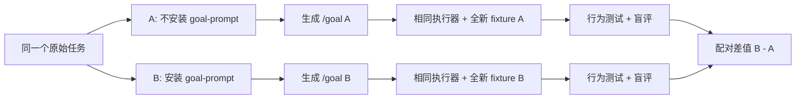

# HugeGraph 代表性 A/B 测试调研与执行计划

> 状态：调研完成；suite 已实现并进入最终复审，尚未运行真实模型 A/B。
>
> 核验日期：2026-08-19（Asia/Shanghai）。涉及 `master` 的事实必须在正式运行前重新核验。

## 1. 结论先行

本项目现有 `skill-up` 测试能比较安装与不安装 `goal-prompt` Skill 后生成的文本，但项目自己的 [eval 说明](../evals/skill-up/README.md) 已明确：生成 `/goal` 只能证明 Prompt 层，不能证明下游任务真的完成。因此，本计划采用“同一原始任务、两阶段配对”的 A/B：

1. **Prompt 生成阶段**：A 不安装 `goal-prompt`，B 安装 `goal-prompt`；两组收到逐字相同的原始任务，只生成 `/goal`，不执行。
2. **下游执行阶段**：把 A/B 各自生成的 `/goal` 原样交给同一执行器，在两个相同且全新的上游仓库工作区中实施；最终以行为测试和任务证据评分。

最终选取三个互补的代表任务：

| 方向 | 代表任务 | 为什么代表性强 | 主行为证据 | 版本考点 |
| --- | --- | --- | --- | --- |
| 前端 | Hubble 空图创建首顶点，再点击顶点补填缺失的 nullable 属性 | 同时覆盖空状态视觉、按钮可达性、真实点击、Drawer/表单状态、POST/PUT 和失败回滚 | [Toolchain issue #486](https://github.com/apache/hugegraph-toolchain/issues/486) | 1.5.0、1.7.0 与 Toolchain `master` 的 1.8.0 **开发线** |
| 后端 | HStore 首次 batch PUT/MERGE 的 Graph ID 隔离 | 覆盖事务批写、Graph ID 分配、物理 key、并发、truncate、rollback 和真实 RocksDB | [HugeGraph issue #3095](https://github.com/apache/hugegraph/issues/3095)、[draft PR #3153](https://github.com/apache/hugegraph/pull/3153) | 1.5.0 静态风险、1.7.0 真实复现、post-1.7 `master`；不存在正式 1.8.0 |
| 文档 | Graphs REST API 中英文版本真相与可执行示例 | 同一页混合旧/新 API、错误 backend、相反版本说明；站点构建通过仍会误导用户 | [英文页](https://github.com/apache/hugegraph-doc/blob/master/content/en/docs/clients/restful-api/graphs.md)、[中文页](https://github.com/apache/hugegraph-doc/blob/master/content/cn/docs/clients/restful-api/graphs.md) | 1.5.0 legacy API、1.7.0 GraphSpace API、post-1.7 修复边界；不得虚构 1.8 |

本轮不修改上游三个仓库，不执行模型 A/B，不新增持久 hash、不冻结输出格式、不建立持久历史基准、不接入 CI/merge 强制门禁，也不 push。

## 2. 仓库与版本真相

用户给出的三个 `hugegraph/*` 地址目前都是公开 fork。A/B 的事实来源和 fixture 应使用 Apache canonical 仓库：

| 用户给出的地址 | Canonical 地址 | 1.5 | 1.7 | 1.8 结论 | A/B 中的写法 |
| --- | --- | --- | --- | --- | --- |
| `hugegraph/hugegraph-toolchain` | [apache/hugegraph-toolchain](https://github.com/apache/hugegraph-toolchain) | 正式 tag/release `1.5.0` | 正式 tag/release `1.7.0` | 无正式 tag/release；`master` 根 POM 是 1.8.0 开发版本，但 HugeGraph 依赖仍为 1.7.0 | “Toolchain 1.8.0 开发线 + Server 1.7.0”，不能写“已发布 1.8” |
| `hugegraph/hugegraph` | [apache/hugegraph](https://github.com/apache/hugegraph) | 正式 tag/release `1.5.0` | 正式 tag/release `1.7.0`，当前最新正式版 | 无 tag、release 或 release branch；`master` POM 仍为 1.7.0 | “1.7.0”或“post-1.7 master snapshot”，不能称 1.8 |
| `hugegraph/hugegraph-doc` | [apache/hugegraph-doc](https://github.com/apache/hugegraph-doc) | `release-1.5.0` branch | `1.7.0` tag/release | 无 1.8 ref；`master` 是滚动双语站点 | “1.5 文档 / 1.7 文档 / 当前 master”，不能创造 1.8 文档版本 |

Primary sources：

- [Toolchain releases](https://github.com/apache/hugegraph-toolchain/releases)
- [HugeGraph releases](https://github.com/apache/hugegraph/releases)
- [hugegraph-doc releases](https://github.com/apache/hugegraph-doc/releases)
- [Toolchain master POM](https://github.com/apache/hugegraph-toolchain/blob/master/pom.xml)
- [HugeGraph master POM](https://github.com/apache/hugegraph/blob/master/pom.xml)

### 2.1 运行时 ref 规则

不在仓库里新增或冻结 commit hash。正式准备 fixture 时：

1. 发布版本只使用官方 tag/branch 名，如 `1.5.0`、`1.7.0`、`release-1.5.0`。
2. `master` 在每次配对开始时只解析一次，再从同一次解析结果生成 A/B 两个工作区。
3. 解析到的 commit 仅写入当次 `.eval-work/` 运行元数据，用于审计，不提交到仓库。
4. 若 `master` 已不再复现，preflight 将该 case 标为 `stale`，不把它伪装成模型失败，也不偷偷回退到未说明的历史状态。

## 3. 为什么要做两阶段 A/B



| 只做什么 | 能回答的问题 | 不能回答的问题 |
| --- | --- | --- |
| 只看生成的 `/goal` | Skill 是否让范围、版本、验收写得更完整 | 更完整的文本是否真的提高实现质量 |
| 只比较最终代码 | 哪个结果更好 | 差异是否由 Prompt 规划造成，还是环境/模型/fixture 漂移造成 |
| 本计划的两阶段配对 | Prompt 质量差异是否传导为真实行为、成本和可靠性差异 | 小样本不能证明普遍统计显著性，只能给出本项目内的探索性证据 |

## 4. 候选筛选

### 4.1 前端候选

评分：点击交互 25、版本辨识 20、前后端链路 20、自动化可验 20、范围可控 15。

| 排名 | 候选 | 具体失败场景 | 点击 | 版本 | 链路 | 可验 | 范围 | 总分 | 决策 |
| ---: | --- | --- | ---: | ---: | ---: | ---: | ---: | ---: | --- |
| 1 | 空图首顶点 + nullable 属性补填 [#486](https://github.com/apache/hugegraph-toolchain/issues/486) | 空结果时创建入口不可达；遗漏可空属性后编辑页也永远不显示 | 25 | 20 | 19 | 18 | 15 | **97** | 选用 |
| 2 | 节点展开的空/失败终态 [#645](https://github.com/apache/hugegraph-toolchain/issues/645) | 点击展开与直接 Gremlin 结果不一致，空结果可能继续 merge | 24 | 20 | 18 | 19 | 14 | **95** | 后续扩展 |
| 3 | GraphSpace/Graph 切换一致性 [#694](https://github.com/apache/hugegraph-toolchain/issues/694) | 切图后路由、schema、查询和任务残留旧上下文 | 23 | 20 | 20 | 9 | 5 | **77** | 范围过大 |
| 4 | 导入流程 JWT 延续 [#721](https://github.com/apache/hugegraph-toolchain/issues/721) | 上传和映射可点击，但执行中途 401 | 18 | 15 | 20 | 10 | 8 | **71** | 认证环境偏重 |

### 4.2 后端候选

评分：代表性 20、调用链/存储 20、事务/并发 20、版本兼容 15、行为 oracle 15、成本 10。

| 排名 | 候选 | 代表性 | 链路 | 事务 | 版本 | Oracle | 成本 | 总分 | 决策 |
| ---: | --- | ---: | ---: | ---: | ---: | ---: | ---: | ---: | --- |
| 1 | HStore Graph ID 隔离 [#3095](https://github.com/apache/hugegraph/issues/3095) | 20 | 20 | 19 | 14 | 15 | 8 | **96** | 选用，深度主任务 |
| 2 | Store Pod 替换后的恢复 [#3124](https://github.com/apache/hugegraph/issues/3124) | 19 | 20 | 20 | 12 | 11 | 3 | **85** | K8s/集群成本过高 |
| 3 | typed `DEFAULT_VALUE` [#3028](https://github.com/apache/hugegraph/issues/3028) / [#3035](https://github.com/apache/hugegraph/pull/3035) | 18 | 18 | 7 | 15 | 15 | 10 | **83** | 推荐作低成本校准题 |

`DEFAULT_VALUE` 跨 core、Text/Binary serializer 与 `hugegraph-struct`，确定性很好；但 canonical 修复已合入，且没有自然的并发、锁、分区或多租户隔离深度。因此它保留为可选短题，不混入本次三项主线完成度。

### 4.3 文档候选

评分：用户伤害 25、版本辨识 25、可验证性 20、双语一致性 15、范围可控 15。

| 排名 | 候选 | 主要风险 | 总分 | 决策 |
| ---: | --- | --- | ---: | --- |
| 1 | Graphs REST API 双语版本真相 | 用户会实际得到 404/415/NPE 或使用已移除 backend | **96** | 选用 |
| 2 | 升级与回滚指南 | 跨版本迁移步骤和 backend 兼容容易混淆 | **87** | 后续扩展 |
| 3 | Release notes / 下载事实 | 版本与下载入口易过期，但行为深度较低 | **82** | 后续扩展 |
| 4 | 版本选择器/提示条 | 视觉有价值，难验证 API 可执行性 | **74** | 不作为代表题 |

## 5. 代表题一：Toolchain 前端交互闭环

### 5.1 已证实的失败链

1. 1.5.0/1.7.0 旧 UI 只有在结果含顶点时才挂载 `GraphQueryResult`，而新增入口位于该组件内。相关源码：[QueryResult.tsx](https://github.com/apache/hugegraph-toolchain/blob/1.7.0/hugegraph-hubble/hubble-fe/src/components/graph-management/data-analyze/query-result/QueryResult.tsx)、[GraphQueryResult.tsx](https://github.com/apache/hugegraph-toolchain/blob/1.7.0/hugegraph-hubble/hubble-fe/src/components/graph-management/data-analyze/query-result/GraphQueryResult.tsx)。
2. 当前 Toolchain `master` 的新 UI 仍只在已有 vertex/edge 时挂载 2D canvas，并把 New 菜单禁用：[Home](https://github.com/apache/hugegraph-toolchain/blob/master/hugegraph-hubble/hubble-fe/src/modules/analysis/QueryResult/GraphResult/Home/index.js)、[GraphMenubar](https://github.com/apache/hugegraph-toolchain/blob/master/hugegraph-hubble/hubble-fe/src/modules/analysis/QueryResult/GraphResult/GraphMenubar/index.js)、[NewConfig](https://github.com/apache/hugegraph-toolchain/blob/master/hugegraph-hubble/hubble-fe/src/modules/component/NewConfig/index.js)。
3. 编辑表单遍历的是对象已有 properties，并与 schema 做交集；schema 中存在、对象中缺失的 nullable 字段不会出现：[EditElement](https://github.com/apache/hugegraph-toolchain/blob/master/hugegraph-hubble/hubble-fe/src/modules/component/EditElement/index.js)。
4. 后端已经有 graphspace/graph 级 vertex POST/PUT 能力：[analysis API](https://github.com/apache/hugegraph-toolchain/blob/master/hugegraph-hubble/hubble-fe/src/api/analysis.js)、[GraphController](https://github.com/apache/hugegraph-toolchain/blob/master/hugegraph-hubble/hubble-be/src/main/java/org/apache/hugegraph/controller/graph/GraphController.java)、[GraphService](https://github.com/apache/hugegraph-toolchain/blob/master/hugegraph-hubble/hubble-be/src/main/java/org/apache/hugegraph/service/graph/GraphService.java)。所以应先修前端状态与交互，不应无证据改 REST shape。

### 5.2 版本矩阵

| 版本面 | 证据结论 | 本 case 用法 |
| --- | --- | --- |
| Toolchain 1.5.0 | 旧 UI 的空结果挂载和编辑交集逻辑存在 | 只读对照，不 backport |
| Toolchain 1.7.0 | 关键旧 UI/store 文件与 1.5.0 同形，问题未被该代消除 | 只读对照；可作为旧 UI 复核 |
| Toolchain `master` | 根 POM 是 1.8.0 开发线；新 React/G6/Graphin 路径仍存在两个失败 | 主实现 fixture |
| HugeGraph Server 1.7.0 | Toolchain master 仍依赖它；POST/PUT 可用于真实持久化 | 主 E2E 后端 |
| “正式 1.8.0” | 不存在 | 任何报告都不得这样表述 |

### 5.3 固定 fixture

| 项 | 值 |
| --- | --- |
| 初始数据 | 0 vertex、0 edge |
| vertex label | `person` |
| ID strategy | `PRIMARY_KEY` |
| 必填/主键 | `name: TEXT` |
| 可空属性 | `description: TEXT` |
| 新增数据 | `name=alice`，初次不填 `description` |
| 后续编辑 | `description=first vertex` |

### 5.4 人工点击明细

| 步骤 | 用户动作 | 必须观察到的 UI | 必须观察到的网络/状态 |
| ---: | --- | --- | --- |
| 1 | 在空图执行 `g.V().limit(10)` | 成功空状态，无 console error | 请求成功、0 结果 |
| 2 | 点击“新建” | 菜单可打开；添加顶点可用；边操作不可用 | 不应提前发写请求 |
| 3 | 点击“添加顶点” | Drawer 挂载；可选 `person`；显示 `name` 和可选 `description` | schema 来源是当前 graphspace/graph |
| 4 | 只填 `name=alice` 并添加 | Drawer 成功后关闭；2D canvas 出现一个节点；计数从 0 变 1 | 只发一次正确 POST；失败时不产生幽灵节点 |
| 5 | 点击 alice，再点“编辑” | `description` 输入框存在且为空 | 不能因属性缺失而隐藏字段 |
| 6 | 填入 `first vertex` 并保存 | 节点详情更新 | 只发一次正确 PUT；失败时本地模型不能假成功 |
| 7 | 刷新或重新查询 | `name` 未丢，`description` 仍存在 | Server 1.7.0 返回持久化值 |
| 8 | 分别模拟 POST/PUT 失败 | 显示既有错误反馈；表单不能无条件丢失 | graphData/count 不错误更新 |

### 5.5 自动验收与评分

| 验收层 | 检查 | 建议方式 | 分值 |
| --- | --- | --- | ---: |
| 组件 | 空结果时 New 可点击、Add Vertex 可达、Edge 不可用 | React Testing Library + user-event | 15 |
| 组件/状态 | 新增成功后 canvas、graphData、count 正确 | mock API + state assertions | 10 |
| 表单 | schema 有 `description`、对象没有时仍渲染字段 | `EditElement` 回归测试 | 15 |
| API/持久化 | PUT 后本地与重新查询都保留两个属性 | mock + Server 1.7 E2E | 15 |
| 失败语义 | POST/PUT 失败不产生幽灵数据或无条件清空 | success/failure tests | 10 |
| 契约 | graphspace/graph URL、method、body、request count 正确 | 浏览器网络断言 | 10 |
| 自动测试 | 新增组件级覆盖 | 前端 test | 10 |
| 真实交互 | 点击菜单、Drawer、节点、Edit、Save | 基于现有 browser smoke 的独立 Playwright 场景，不接入 CI/merge 强制门禁 | 10 |
| 版本诚实 | 正确区分 1.5/1.7/1.8 开发线 | 结果审阅 | 5 |
| **合计** |  |  | **100** |

评分上限：只改视觉/disabled 属性但点击或 API 不通，最高 40；无浏览器点击与网络证据，扣 20；破坏无端点时的边操作限制，扣 15；把 master 写成正式 1.8，扣 10。

## 6. 代表题二：HugeGraph 后端深度隔离

### 6.1 可观察失败

在全新 HStore 环境中创建两个不同的 graphspace、graph 和 store，两个图的首次写入都走同一 partition/table 上的 batch transaction，并使用相同 logical key：

- 只向 A 做 batch PUT，B 却可能读到或覆盖 A 的值；
- A/B 的 MERGE counter 可能跨图累加；
- truncate B 可能删除 A 的数据；
- 每个 batch 都能正常 commit，但数据落进了错误的图命名空间。

公开 issue 给出了 1.7.0 Docker/HStore 复现；公开 draft PR 说明故障位于首次批写前没有分配 Graph ID，多个新图会使用保留值 `0xFFFE` 作为相同物理 key 前缀。正式 case 的执行 prompt 不暴露 issue、PR 或根因，防止答案泄漏；这些只用于 fixture 设计和隐藏评分。

完整的 #3095 oracle 必须拆成两层，不能用 store-core 测试替代 REST 多租户路由：

| Oracle 层 | 运行面 | 必须证明的事实 |
| --- | --- | --- |
| L1：Direct REST 隔离 smoke | HugeGraph Server 1.7.0 + auth-enabled HStore/PD/Store，使用不同 graphspace、graph、store | 从 REST 创建两套 namespace；只向 A 写 marker 后，A 可见、B 不可见，且不同 graph/store 确实映射到独立的 store identity |
| L2：Focused store-core 回归 | 真实 `BusinessHandler` + RocksDB | PUT/MERGE 经 `doBatch()`，读取经 `doGet()`，清理经 `truncate()`；rollback/失败使用实际 session/handler API；并发首次分配无冲突或死锁 |

L2 能精确验证物理 key 根因，但单独通过时最多证明 store-core graph identity 隔离，不能声称完整 GraphSpace/graph/store REST 路由已修复。完整代表题必须同时通过 L1 和 L2。

### 6.2 调用链检查表

| 层 | 关键类/路径 | Agent 必须说明或验证的行为 |
| --- | --- | --- |
| Graph 生命周期 | `hugegraph-api/.../profile/GraphsAPI.java` | graphspace/graph/store 的创建身份 |
| Graph 管理 | `hugegraph-api/.../core/GraphManager.java` | 配置与 backend 初始化 |
| Backend identity | `hugegraph-core/.../BackendProviderFactory.java` | graphSpace/store 如何形成隔离语义 |
| Server transaction | `hugegraph-server/hugegraph-hstore/src/main/java/org/apache/hugegraph/backend/store/hstore/HstoreSessionsImpl.java` | begin/commit/rollback |
| Client transaction | `hg-store-client/.../NodeTxSessionProxy.java` | batch mutation 缓存 |
| Client executor | `hg-store-client/.../NodeTxExecutor.java` | partition/node session、commit/retry |
| gRPC/Raft | `hg-store-node/.../grpc/HgStoreSessionImpl.java` | 按 partition 提交 BATCH_OP |
| Store transaction | `hg-store-core/.../BusinessHandler.java` | `doBatch()` 承载 PUT/MERGE；读取、truncate、commit/rollback 分别走其实际 handler/session API |
| 故障点 | `hg-store-core/.../BusinessHandlerImpl.java` | TxBuilder PUT/MERGE 如何编码 physical key |
| 隔离 key | `InnerKeyCreator.java`、`GraphIdManager.java` | 首次分配、保留 ID、锁和表生命周期 |
| 真实存储 | RocksDB session/table | 字节前缀才是最终隔离边界 |

Canonical source links：[BusinessHandlerImpl](https://github.com/apache/hugegraph/blob/master/hugegraph-store/hg-store-core/src/main/java/org/apache/hugegraph/store/business/BusinessHandlerImpl.java)、[InnerKeyCreator](https://github.com/apache/hugegraph/blob/master/hugegraph-store/hg-store-core/src/main/java/org/apache/hugegraph/store/business/InnerKeyCreator.java)、[GraphIdManager](https://github.com/apache/hugegraph/blob/master/hugegraph-store/hg-store-core/src/main/java/org/apache/hugegraph/store/meta/GraphIdManager.java)。

### 6.3 为什么普通机制挡不住这个失败

| 常见机制 | 为什么挡不住 | 本任务真正需要的证据 |
| --- | --- | --- |
| Git | 只能标识源代码，不验证运行时 namespace 编码 | 同一源码下两个新 graph 的真实批写隔离 |
| 版本号 | 只能说明发布面；1.7.0 中参数、类型都合法 | 1.7.0/post-1.7 的行为测试 |
| graph/store 名称或主键 | 名称和 logical key 都合法，但未进入最终两字节前缀 | 同 logical key、不同 graph 的 physical isolation |
| 事务 | 每个 batch 可原子成功，却原子地写进错误 namespace | rollback + retry + 跨图不可见性 |
| 唯一约束 | RocksDB 只看到相同 byte key，不理解 graph 所有权 | 每图唯一且非保留的 Graph ID |
| 类型系统 | graph ID 的类型合法，错误在 sentinel 的业务语义 | 禁止把“未分配”值持久化为 key prefix |
| 普通现有单测 | GraphIdManager 单测未穿过真实 `BusinessHandler.doBatch()` 和 RocksDB | 修复前红、修复后绿的真实存储集成测试 |

这个具体场景足以支持新增普通回归/集成测试；仍不需要新 hash、冻结输出格式、持久对照基准或 CI/merge 强制门禁。

### 6.4 版本矩阵

| 版本面 | 结论 | 本 case 用法 |
| --- | --- | --- |
| 1.5.0 | TxBuilder 有同形 `getKey()` 风险，但没有 1.7 GraphSpace REST 语境 | 只做静态兼容分析；若没真实运行，不得声称完整复现 |
| 1.7.0 | issue 的真实复现版本 | 必须作为稳定行为 fixture |
| post-1.7 `master` | 调研时 POM 仍为 1.7.0，draft 修复尚未合入 | preflight 后可作为当前实现对照 |
| 正式 1.8.0 | 不存在 | 不执行、不声称 |

### 6.5 后端验收与评分

| 项 | 必须验证的细节 | 分值 |
| --- | --- | ---: |
| REST namespace 隔离 | auth-enabled 1.7 HStore 中，不同 graphspace/graph/store 经 direct REST 创建和查询；A marker 在 B 不可见 | 15 |
| PUT 隔离 | store-core 同 partition/table/key 下 A/B 值独立，PUT 经 `doBatch()`、读取经 `doGet()` | 12 |
| MERGE 隔离 | `doBatch()` counter 不跨 graph 累加 | 8 |
| truncate 隔离 | truncate B 不损坏 A | 8 |
| rollback | 失败 batch 无可见部分数据，之后重试成功 | 7 |
| 并发首次写 | 多个新 graph 获得不同有效 ID，无竞态、死锁或超时 | 15 |
| 兼容性 | 已有有效 ID 仍可读；key/API/config 不变；历史 sentinel 不被猜测迁移 | 10 |
| 测试质量 | L1 REST smoke + L2 真实 handler/RocksDB；修复前红、修复后绿 | 12 |
| 实现范围 | 修根因，无无关依赖、版本或 backend 矩阵变更 | 7 |
| 验证/审阅 | REST smoke、store-core test、全量 compile、三路独立 reviewer | 6 |
| **合计** |  | **100** |

建议验证命令：

```bash
mvn test -pl hugegraph-store/hg-store-test -am -P store-core-test -Djacoco.skip=true -ntp
mvn clean compile -Dmaven.javadoc.skip=true -ntp
# 另运行 suite 准备的 1.7.0 auth-enabled HStore direct REST smoke；
# 实际脚本名由实现阶段读取现有 Docker/assembly 设施后确定，不能臆造。
```

硬失败：任何跨图读取/覆盖/MERGE/truncate 泄漏；并发死锁；改变 public API 或 physical-key 格式；只做 mock 而不走 RocksDB；把 1.8 当正式版本。未运行 L1 REST smoke 时该题最高 80 分且不能报告完整 #3095 已修复。历史 `0xFFFE` 数据无法可靠反推原 graph，自动猜测迁移不在范围内。

## 7. 代表题三：Graphs REST API 双语文档

### 7.1 当前页面的客观问题

| 问题 | 英文页 | 中文页 | 用户后果 |
| --- | --- | --- | --- |
| NPE 影响范围 | 页面笼统写“1.7.0 动态建图会 NPE”，并称当前 master 与 1.7 之后不受影响 | 同样先笼统写 1.7.0 NPE，却称当前 master 与 **1.7 之前**不受影响 | 双语相反，而且两边都没有限定 #2912 的非鉴权上下文 |
| 1.5 API | 页尾提示 1.5 及之前应使用 legacy `text/plain` | 同样提示，但没有把完整路径/请求体与 1.7 分开 | 用户可能把 JSON 发给旧 endpoint，得到 404/415 |
| 1.7 API | 使用 `/graphspaces/{space}/graphs/{graph}` + JSON | 同上 | 应作为独立可复制流程，而不是与旧示例混写 |
| backend 示例 | 响应与 conf 示例仍出现 Cassandra | 同样出现 Cassandra | 1.7 主线 backend 已收缩，示例制造错误选择 |
| 修复边界 | [#2912](https://github.com/apache/hugegraph/pull/2912) 在 1.7 发布后修复非鉴权上下文中 creator 取值 NPE | 同一事实写反且未区分鉴权/非鉴权 | 不能泛化成所有 1.7 动态建图都坏，也不能把 post-release 修复倒推成 1.7 release 行为 |

当前页面证据：[英文 Graphs API](https://github.com/apache/hugegraph-doc/blob/master/content/en/docs/clients/restful-api/graphs.md)、[中文 Graphs API](https://github.com/apache/hugegraph-doc/blob/master/content/cn/docs/clients/restful-api/graphs.md)。

### 7.2 限定修改范围

| 路径 | 职责 |
| --- | --- |
| `content/en/docs/clients/restful-api/_index.md` | 英文 REST 总览和版本入口 |
| `content/cn/docs/clients/restful-api/_index.md` | 中文 REST 总览和版本入口 |
| `content/en/docs/clients/restful-api/graphs.md` | 英文 Graphs API 版本化流程 |
| `content/cn/docs/clients/restful-api/graphs.md` | 中文 Graphs API 版本化流程 |

除非源码证据要求，不扩展为全站重写、版本选择器或站点框架迁移。

### 7.3 读者可执行矩阵

| 读者版本 | 文档必须给出的独立路径 | 必须说明的边界 |
| --- | --- | --- |
| 1.5.0 | legacy graph endpoint、`Content-Type: text/plain`、properties body、对应鉴权/删除流程 | 不使用 1.7 GraphSpace JSON 示例；只引用 1.5 server source |
| 1.7.0 | `/graphspaces/{space}/graphs/{graph}`、`application/json`、受支持 backend 示例、鉴权要求 | 鉴权模式是文档支持路径；另说明非鉴权上下文中 creator 取值 NPE，且不要声称 release 已包含后来的修复 |
| 当前 `master` | 与当前 server source 对齐的 JSON 流程 | 明确“post-1.7 master 修复非鉴权 creator NPE”，而不是发明 1.8 |
| 1.8 | 无正式 release/ref | 明确不存在；不提供臆造命令 |

Server primary evidence：[1.5.0 GraphsAPI](https://github.com/apache/hugegraph/blob/1.5.0/hugegraph-server/hugegraph-api/src/main/java/org/apache/hugegraph/api/profile/GraphsAPI.java)、[1.7.0 GraphsAPI](https://github.com/apache/hugegraph/blob/1.7.0/hugegraph-server/hugegraph-api/src/main/java/org/apache/hugegraph/api/profile/GraphsAPI.java)、[1.7 GraphSpace change #2900](https://github.com/apache/hugegraph/pull/2900)、[post-1.7 NPE fix #2912](https://github.com/apache/hugegraph/pull/2912)。

### 7.4 文档验收与评分

| 项 | 验收明细 | 分值 |
| --- | --- | ---: |
| 版本事实 | 1.5/1.7/master/不存在的 1.8 边界全部正确 | 30 |
| API 行为 | endpoint、Content-Type、auth、body、backend、状态码与 server source 对齐 | 25 |
| 可执行性 | 每个受支持版本有互不混写的 create/query/delete 示例 | 15 |
| 双语一致 | 中英文语义、警告和示例等价 | 10 |
| 站点质量 | Hugo build 与链接检查通过 | 10 |
| 证据/范围 | 引用 primary sources，不扩散为全站重构 | 10 |
| **合计** |  | **100** |

建议命令：

```bash
bash dist/validate-links.sh
npm install
hugo --minify
```

现有 CI 只证明链接/Hugo 构建，不能证明 API 行为。正式评分还需基于 1.5/1.7 server source 的证据检查，并分别核验 auth-enabled 支持路径和 non-auth #2912 失败路径；条件允许时做隔离 Docker smoke，但不接入 CI/merge 强制门禁。

评分上限：虚构已发布 1.8，最高 50；误写 #2912 进入 1.7 release 或泛化成所有鉴权模式都 NPE，最高 59；只改一种语言，最高 75；Hugo 构建失败，最高 70。

## 8. 统一 A/B 实验协议

### 8.1 唯一变量

| 维度 | A：Control | B：Treatment |
| --- | --- | --- |
| 原始用户任务 | 与 B 逐字相同 | 与 A 逐字相同 |
| `goal-prompt` | 不安装 | 安装当前待测版本 |
| 任务要求 | 只生成 `/goal`，不实施 | 只生成 `/goal`，不实施 |
| 下游执行 | 同一执行器原样执行 A 的输出 | 同一执行器原样执行 B 的输出 |

以下全部固定：模型、reasoning effort、max turns、timeout、工具权限、网络策略、JDK/Node/Maven、依赖缓存策略、上游 ref、fixture 数据、重试策略、执行 reviewer 数量、隐藏测试和评分 rubric。

不要把“手写短 Prompt”和“结构化长 Prompt”直接当主 A/B；那会同时改变措辞、信息量与 Skill 是否存在，无法归因。对应的人工参考 `/goal` 只用于调试 evaluator，正式效应量仍来自 `with_skill` / `without_skill` 配对。

### 8.2 防泄漏与隔离

| 风险 | 控制 |
| --- | --- |
| 公开 issue/PR 已含答案 | 执行任务不出现编号、链接、根因或精确补丁；执行器关闭外网 |
| Git 历史泄漏修复 | 用 `git archive`/无 `.git` fixture；judge 在独立位置保存 oracle |
| 无 `.git` 后无法核验版本 | 可信 preflight 为每题生成只读 `version-evidence` manifest，并注入必要 ref 的源码证据；两臂获得完全相同内容 |
| A/B 共享状态 | 每个 variant 和 repeat 使用全新工作区、HOME、图数据目录和会话 |
| A/B 共享服务状态 | 每个匿名臂由 reviewed service spec 创建独占数据根和唯一 Docker internal network；真实 HTTP health probe 通过后才运行，所有终态都执行 cleanup |
| Agent 伪造 score/oracle | Agent 只挂载 `agent-artifacts`；可信 evidence/score/run 位于未挂载目录，并绑定匿名 run、pair、source/evidence 与执行策略 |
| Oracle 执行不可信构建 | command oracle 在第二个受限容器中由 root controller 运行；测试命令降权并只接触 disposable workspace/pristine volume 与只读 Agent 产物，不能读取 root-only spec/runner 或改写 root-owned evidence；不继承宿主凭据，不在宿主执行 Maven/Node/Hugo |
| 模型端点变成通用外网代理 | Prompt OpenSandbox 只声明模型 hostname；Prompt 与下游都读取真实 policy endpoint，验证 provider API only、公开答案源不可达并通过 TLS 后的 HTTP CONNECT 请求确认不能隧道；attestation 绑定实际 sandbox/service image 与非敏感认证身份 |
| 移动 master 漂移 | 每个 pair 只解析一次并复制两份；运行元数据记录解析结果，不提交 hash |
| Judge 看到 variant | 对结果目录做匿名映射，完成评分后再解盲 |
| 只汇总成功 pair | Pilot/Formal 先把全部 pair 与 Prompt/执行顺序写入 `.eval-work` cohort ledger，2/1 校验后 seal；运行顺序必须匹配 sealed plan，汇总输入必须与 ledger 完全一致并绑定所有 terminal arms，失败 pair 不能由新成功 pair 替换 |
| 上游已修复 | preflight 标记 `stale`，该 case 不计胜负 |

### 8.3 运行规模

| 阶段 | 每题配对次数 | 总 Prompt 运行数 | 总下游执行数 | 用途 |
| --- | ---: | ---: | ---: | --- |
| Pilot | 1 | 3 题 × 2 臂 = 6 | 6 | 验证 fixture、timeout、rubric 和成本 |
| 正式最小集 | 3 | 3 题 × 2 臂 × 3 = 18 | 18 | 报告中位数、通过率和逐 pair 差值 |
| 可选扩样 | 5+ | 按需 | 按需 | 只有 Pilot 方差大且用户愿意增加成本时执行 |

三次重复只作为工程探索，不宣称统计显著。Pilot 的三题在 Prompt 和下游阶段分别形成跨题 2/1 首角色平衡；Formal 则在每题三次重复中分别形成 2/1 平衡。所有 pair 必须先登记并 seal 完整排程，汇总器对未 seal、顺序偏离或 pair 集不完整的 cohort 都失败关闭。移动 ref 每 pair 只解析一次并复制给两臂，因此正式报告逐 pair 记录 source/evidence snapshot；同一 case 的 oracle/service policy 保持一致，不要求三个 repeat 的时间戳证据 digest 相同。

### 8.4 指标与判读

| 指标 | 计算 | 优先级 | 判读 |
| --- | --- | --- | --- |
| 下游任务分 | 每题 0–100 rubric | 主指标 | 对相同 pair 计算 `B - A`，再报告中位数 |
| 硬失败率 | critical failure / run | 主 guardrail | B 不得通过高总分掩盖数据泄漏、交互不通或版本造假 |
| 完成率 | 所有主线验收条件通过的 run 占比 | 主指标 | 区分“写了很多”与“真正完成” |
| Prompt 目标覆盖分 | 目标、范围、版本、验证、阻塞/恢复、review 是否完整 | 次指标 | 解释为什么下游有差异 |
| 成本 | tokens、wall time、turns | 次指标 | 同时报告绝对值和配对增量 |
| 稳定性 | 3 次分数离散、win/tie/loss | 次指标 | 避免只展示最好一次 |

推荐总体权重只用于汇总展示，不替代逐题结果：前端 35%、后端 40%、文档 25%。后端权重最高是因为数据隔离错误影响最大；仍必须保留每题明细，不能用总分抹平某题硬失败。

## 9. 用户禁用项的处理边界

### 9.1 允许本次做 A/B 的具体失败场景

当前 prompt-level case 即使通过，也可能生成一份看似完整的 `/goal`，却漏掉：

- 前端必须真实点击才能发现的空状态组件不可达；
- Toolchain `master` 的“1.8 开发线”和正式 1.8 release 的区别；
- 后端同一事务成功提交到错误 graph namespace；
- 文档 Hugo 构建通过但命令实际 404/415/NPE。

Git、版本号、主键、事务、唯一约束、类型系统和普通单次测试都不能回答“这些遗漏是否由 `goal-prompt` 改善”，所以需要配对 A/B 和下游行为评分。

### 9.2 明确不做

| 不做项 | 本计划替代方式 |
| --- | --- |
| 新增持久 source hash | 使用官方 ref；每次 pair 临时解析并记录在 `.eval-work/` |
| 冻结输出格式 | 评分目标/范围/证据，不要求固定 JSON 或固定标题措辞 |
| 建立持久历史基准 | 只在当次运行生成临时 `without_skill` 对照臂，不提交 golden 输出或历史阈值 |
| 新增强制门禁 | suite 独立、手动运行；不接 CI/merge enforcement，不阻塞现有 PR |
| 用预期 patch 评分 | 使用行为 oracle；实现方式可以不同 |

## 10. 建议的仓库落地结构

```text
evals/skill-up/hugegraph-ab/
├── README.md
├── eval.yaml
├── cases/
│   ├── toolchain-empty-graph-edit.yaml
│   ├── server-hstore-graph-isolation.yaml
│   └── docs-graphs-api-version-truth.yaml
├── rubrics/
│   ├── toolchain.md
│   ├── server.md
│   └── docs.md
└── scripts/
    ├── prepare-fixtures.sh
    ├── preflight.sh
    ├── run-prompt-pairs.sh
    ├── run-execution-pairs.sh
    ├── container-isolation.sh
    ├── container-network-probe.py
    ├── service-harness.py
    ├── oracle-isolation.sh
    ├── trusted-command-oracle.py
    ├── judge-run.py
    └── summarize-pairs.py
```

说明：

- 新 suite 与当前快速回归分离，默认 `benchmark.enabled: false`。runner 仅在用户显式选择 paired comparison 时，为两种角色分别生成一次性单臂配置；两份配置只有 `skills: []` 与本地 `goal-prompt` Skill 不同，并由 `--order ab|ba` 平衡顺序。不创建或提交持久历史基准。
- 所有 clone、archive、HOME、模型输出、运行记录和 oracle 临时数据放在已有忽略目录 `.eval-work/`。
- 不把上游源码副本、模型输出、golden patch 或结果快照提交进仓库。
- 如果当前 skill-up 版本不能串联“生成 Prompt → 执行 Prompt”，在 suite 外层用薄 wrapper 编排，不修改或冻结模型输出格式。
- 下游真实执行只接受 checked-in 隔离器、service harness 和 oracle isolation：每臂独立创建服务网络/数据，Agent 不挂载 trusted artifacts；模型 endpoint policy 与真实私服 health 经过容器内探测；oracle 也不在宿主执行不可信源码。
- Pilot/Formal、fake/deterministic 使用显式 cohort；Pilot/Formal 必须使用临时 ledger。模型失败写入可信零分，环境失败保持未评分；正常汇总的 pair 集必须与 ledger 完全一致，所有匿名臂有绑定 score 后才允许读取角色映射。

## 11. 可执行阶段计划

| 阶段 | 任务明细 | 产物 | 验证 | 完成条件 |
| --- | --- | --- | --- | --- |
| P0 预检 | 重新核验 canonical、refs、release、master POM、issue/PR 状态；确认三题仍可复现 | preflight 日志 | `gh`/`git ls-remote`/源码断言 | 不存在版本造假；stale case 被明确跳过 |
| P1 套件骨架 | 创建独立目录、README、eval config、结果目录约定 | suite scaffold | `skill-up validate`、shell syntax | 不影响当前快速 suite 和 CI |
| P2 Fixture | 为三题准备无 `.git` 的 A/B 双份**工作源码**与数据；可信 preflight 另注入相同的 `version-evidence` manifest/必要 ref 源码证据 | `.eval-work/...` | source tree diff、version evidence、ref metadata | A/B 除 Skill 外一致，Agent 可改源码且无需网络/Git 历史 |
| P3 Prompt cases | 写三份逐字共享的 raw request；只要求生成 `/goal` | 3 case YAML | dry-run、人工确认无答案泄漏 | without/with 收到相同文本 |
| P4 Judge/rubric | 实现 Prompt 目标评分、三题行为评分、硬失败上限；后端同时要求 L1 REST 与 L2 store-core | rubric + judge scripts | judge 自测、故意坏样例 | 能拒绝视觉假修、仅 store-core 冒充完整 REST 修复、mock 假修和版本造假 |
| P5 两阶段 runner | 捕获每臂 response，原样交给同一执行器；每臂 service/network/data 独立；Agent/trusted artifacts 分离；oracle 容器隔离；cohort ledger 匿名评分 | runner scripts | fake executor 伪造 score、partial Prompt ERROR、失败臂、ledger/order/identity smoke | variant 隔离、无共享 session/HOME/service，失败不能被省略或伪造 |
| P6 Pilot | 每题 1 个 pair；记录 red/green、tokens、时间和不稳定点 | pilot report | 6 prompt + 6 execution artifacts | fixture/rubric 可用，阻塞项分类清楚 |
| P7 正式运行 | 每题 3 pairs，交替顺序，盲评 | paired results | 结果完整性检查 | 每次有 score、critical failures、成本 |
| P8 分析 | 报每题明细、配对差值、中位数、W/T/L，不筛最好结果 | Markdown/JSON report | 独立复算 | 结论能追溯到每个 pair |
| P9 收尾 | 三名独立 reviewer 分别审协议公平性、上游事实/版本、judge/脚本正确性；修完高危问题 | review evidence | 当前项目测试/validate | 主线验收条件全通过，本地提交；不 push |

### 11.1 失败与恢复规则

| 失败 | 处理 |
| --- | --- |
| Prompt/执行模型失败 | 自动重试为 0；保留匿名终态和可信零分，不单独重跑某一 arm，不从 cohort 删除 |
| provider/容器/服务环境失败 | 记录未评分匿名环境失败并保留原 cohort；若需要重试则新建完整 cohort，不能在原 ledger 中用成功 pair 替换失败 pair |
| 上游下载失败 | 继续完成本地 case/judge；恢复后重试 fixture，不把网络失败记为模型失败 |
| 前端浏览器环境缺失 | 组件测试可继续，但该 run 不能宣称 E2E 完成 |
| RocksDB native 环境失败 | 先区分环境失败与测试红；真实路径未运行时后端不得 100 分 |
| Hugo/Docker 不可用 | source-based judge 可继续；未运行的 smoke 明确列出 |
| 三题只剩同一个外部阻塞 | 才可把整体 goal 标为 blocked；否则继续独立工作 |

## 12. 风险与待决策项

| 风险/决策 | 当前建议 | 是否阻塞主线 |
| --- | --- | --- |
| HStore case 成本高 | 保留为深度主任务；Pilot 先测真实 store-core 时间 | 否 |
| 公开 PR 泄漏 | 运行 Agent 关闭外网，任务体不含编号/根因，fixture 无 `.git` | 是，若无法隔离只能标探索性 |
| Toolchain master 会移动 | 每 pair 同源解析；stale 则跳过 | 否 |
| 是否加入 typed default 短题 | 仅在主三题稳定后作为可选校准，不混入主完成度 | 否 |
| 是否接 CI | 当前不接；先拿到至少一轮完整正式结果再单独决策 | 否 |
| 是否扩大到 5 repeats | Pilot 方差或边际结果明显时再由用户决定 | 否 |

## 13. 本计划的完成定义

调研/设计阶段完成需要同时满足：

- 三个 canonical 仓库及 1.5/1.7/1.8 真相有 primary-source 证据；
- 每个方向有候选评分和明确选型；
- 前端包含视觉、真实点击、API、失败状态与版本验收；
- 后端包含真实存储、事务、并发、兼容与普通机制为何挡不住的说明；
- 文档包含双语、读者可执行流程、版本和 server-source 行为验证；
- A/B 只有一个主变量，Prompt 层和下游行为层均可评分；
- 已给出逐阶段计划、rubric、硬失败、风险、恢复和不做范围；
- 对应可复制 Prompt 位于 [hugegraph-ab-test-prompts.zh-CN.md](hugegraph-ab-test-prompts.zh-CN.md)。

套件已实现并完成确定性验证；真实 Pilot 与正式运行尚未开始，不能把本计划的完成误报为 A/B 已经证明 `goal-prompt` 更好。
